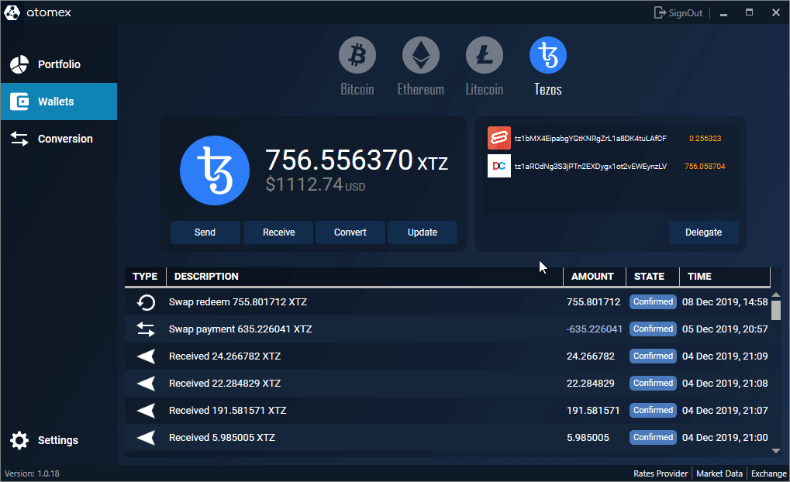

In this chapter, we will see how to delegate your coin via command lines or simply using a built-in delegation from wallets.

Self-baking lets a baker earn a higher yield but requires technical expertise and time to set up a baker node and run the baking software reliably with as little downtime as possible. By delegating Tezos tokens, a token holder avoids this process altogether but usually earns a lower yield. In the current protocol, token holders with less than 8,000 XTZ can only bake by delegating to another baker.

Delegation is when you delegate your staking/baking rights to another person (the baker) rather than setting your Tezos node. It's a pretty helpful feature as it allows you to participate in staking and receive Tezos staking rewards without the necessity of maintaining a node.

In that case, all staking rewards are credited to the baker. The baker manually (or using automated tools) pays delegators (people who delegated to him) their share of staking rewards after charging some service fee.

Delegation in Tezos is safe! Your funds are not locked or frozen and do not move anywhere. You can spend them at any time and without any delay. Just keep in mind, you only delegate your rights; that's it.

In short, delegation is much better for an average user. Yes, Tezos bakers get slightly more staking rewards. Still, they pay for hosting; they spend time maintaining a node, and they have a risk of losing money on double baking (e.g., if the node was misconfigured). Thus, delegation is the most preferred and safe way for an average user to participate in Tezos staking.

## CLI delegation

## Built-in delegation

Wallets like [Atomex](https://atomex.me/), [Exodus](https://www.exodus.com/), [Temple](https://templewallet.com/), etc. allows you to simply delegate your coins in a few clics.

The few main steps are as follows:

1. Create a wallet
2. Suplly your wallet with XTZ
3. Click on "Delegation" part
4. Choose a baker
5. Choose the amount to delegate
6. Start earning interest

<small className="figure">FIGURE 1: Delegating your XTZ on _Atomex_.</small>

That's it. The only thing you should worry about is choosing an excellent and reliable Tezos baker or delegation service. 

[Baking Bad](https://tzkt.io/bakers/), [TzStats](https://tzstats.com/bakers) or [Tezos Nodes](https://tezos-nodes.com/) allow you to browse through bakers. allow you to browse through bakers. There are a few factors to consider when choosing a baker to delegate with:

- *Fees*: How much of the rewards is the baker keeping? 

- *Capacity*: Each baker has a capacity of how many coins it can accept, which is based on how many coins it currently holds itself. A baker is "over-delegated" when it has exceeded the amount of delegation it can take considering the coins they currently hold.    

- *Reliability + Responsiveness*: Does this baker pay on time? Does this baker pay correctly? Will this baker respond to my questions about their services? Many bakers operate forums and chat rooms in which they engage with delegators.

- *Security*: Is this baker's staking setup secure? Does this baker have a track record? Has this baker double-baked in the past and lost coins?

> For more details, check out the [List of Bakers](baking/bakers_list) chapter of the [Baking](/baking) module.