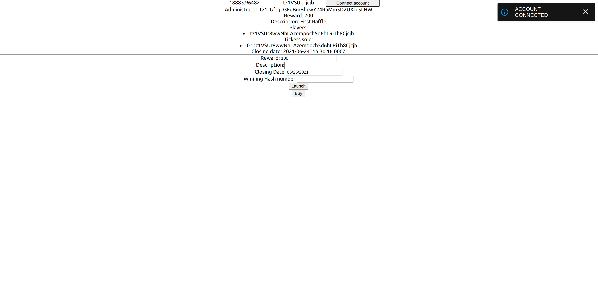
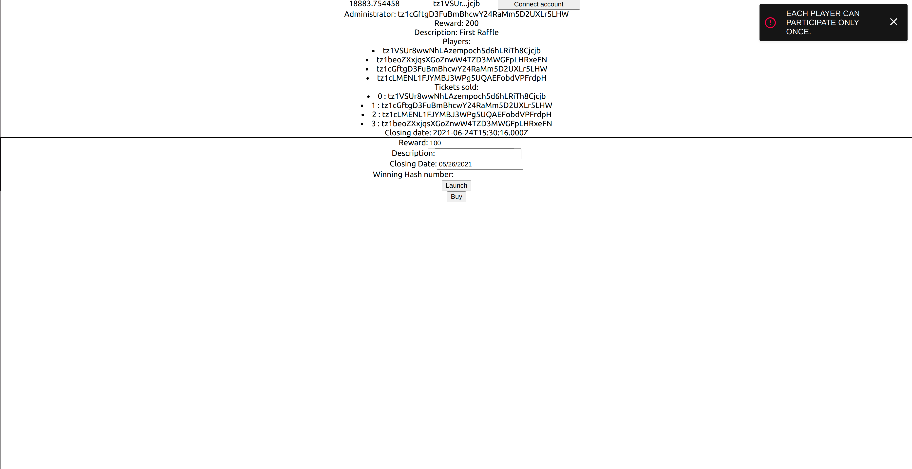
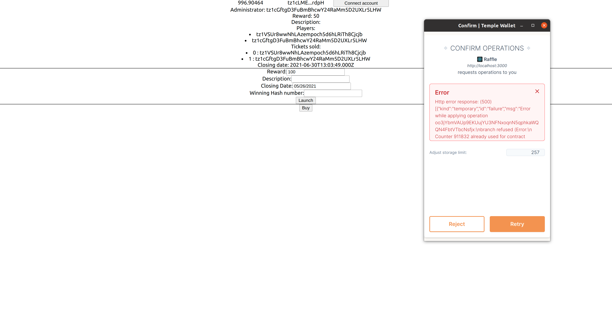
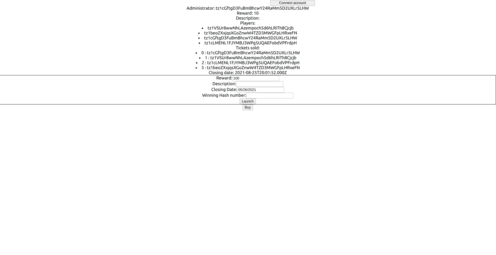
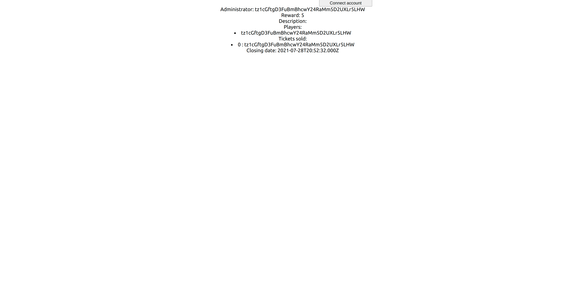
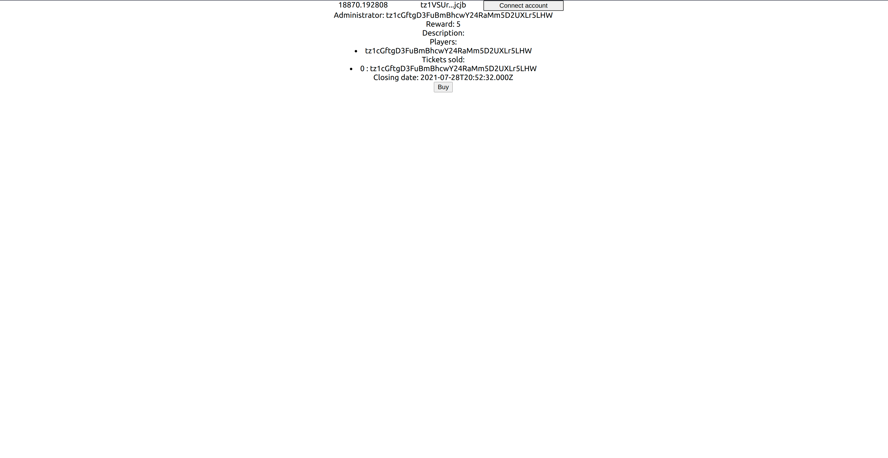

In the previous chapter, the basic usages of the _Temple Wallet_ were covered. The React app that was developed is functional.
The app displays the storage information and enables the user to make two contract calls: the first to open a raffle and the second to buy a ticket.

However, the user experience could be improved for these aspects of the application:
1. transactions: if the user wants to send two transactions in a row, he needs to wait for the first transaction to be confirmed before sending the second one. Thus, the application should prevent the user from sending several transactions and should keep the user informed about the confirmed transactions.
2. storage information: everyone should be able to read the storage information. However, our app requires you to connect your temple wallet, before. This method has to be improved.
3. Some parts of the application should not be reachable to everyone: only the contract administrator should be able to fill the form and open the raffle, and an address having already bought a ticket should not be able to try to buy, another one.

In this chapter, we will refactor the react app to fix these three points.


# Adding notifications

The project can be found here: [https://github.com/bepi-octo/raffle-react-app](https://github.com/bepi-octo/raffle-react-app)

To install the project:
``` shell
$ yarn install
```

To run the application:
``` shell
$ yarn start
```
First, we will integrate alert notifications into our app. A notification should pop up when a transaction is sent, and when a transaction succeeds or fails.

We will use two node modules for the notifications: [react-alert](https://www.npmjs.com/package/react-alert) and [react-alert-template-basic](https://www.npmjs.com/package/react-alert-template-basic)

`react-alert` uses `react-alert-template-basic` to create a context provider.

Let's import the two modules and set a configuration:
``` typescript jsx
import { positions, Provider as AlertProvider, types, useAlert } from "react-alert";
//@ts-ignore
import AlertTemplate from "react-alert-template-basic";


const alertOptions = {
  timeout: 5000,
  position: positions.TOP_RIGHT,
  type: types.ERROR,
};

```

We can add the provider and configure it:
``` typescript jsx 
function App() {
  return (
    <AlertProvider template={AlertTemplate} {...alertOptions}> // alert provider
    <DAppProvider appName={APP_NAME}>
      <React.Suspense fallback={null}>
        <Page>
          <ConnectionSection></ConnectionSection>
          <RaffleInformation></RaffleInformation>
          <LaunchRaffleSection></LaunchRaffleSection>
          <BuyTicketButton></BuyTicketButton>
        </Page>
      </React.Suspense>
    </DAppProvider>
    </AlertProvider>
  );
}

export default App;
```

Let's test it: we will display a notification when connecting a new account. 
There are three types of alerts:
- `info`: display some information
- `success`: display the success of an operation
- `error`: display the failure of an operation

We will use an `info` alert:

``` typescript jsx
function ConnectionSection() {
  const alert = useAlert();
  const connect = useConnect()
  const accountPkh = useAccountPkh()
  const tezos = useTezos()
  const [balance, setBalance] = React.useState(null)
  const handleConnect = React.useCallback(async () => {
    try {
      await connect(NETWORK, { forcePermission: true })
      alert.info("Account connected"); // will display an alert after connection
    } catch (err) {
      console.error(err.message)
    }
  }, [connect, alert])

  ...
}
```
Let's try our app and connect a new account:



An alert appears in the top-right corner and disappears after five seconds.

# Adding transaction notifications

Now that we know how to add notifications, we can use them to notify the user of contracts if a call is a success or failure.

Let's take the example of the call to the `openRaffle` entrypoint.

``` typescript jsx
  const launchRaffleCallback = React.useCallback(
    ({ reward, description, closingDate, winningTicketHash }: launchRaffleParameters) => {
      return (contract as any).methods
        .openRaffle(reward, closingDate, description, web3.utils.asciiToHex(winningTicketHash).slice(2))
        .send({ amount: reward });
    },
    [contract]
  );
```

Every contract call is unsynchronized and returns a `Promise<TransactionWalletOperation>`. The [`TransactionWalletOperation`](https://tezostaquito.io/typedoc/classes/_taquito_taquito.transactionwalletoperation.html#confirmation) class contains the information of transactions sent by the wallet. The `confirmation` method waits for the transaction confirmation and returns a promise. If it is _fulfilled_, the transaction is confirmed; the user should be notified with `alert.success`. On the other hand, if it is _rejected_, the transaction has failed. A [`TezosOperationError`](https://tezostaquito.io/typedoc/classes/_taquito_taquito.tezosoperationerror.html) is raised, containing information about the tezos context (rpc, address used...) and the error message; the user should be notified with `alert.error`, displaying the error message.

``` typescript jsx
return <button onClick={() => {
    launchRaffleCallback({
      reward: raffleReward,
      description: raffleDescription,
      closingDate: raffleClosingDate,
      winningTicketHash: raffleWinningHashNumber
    }).then((e: TransactionWalletOperation) => {
      alert.info("Launching new raffle ...");
      e.confirmation().then((e: any) => {
        alert.success("New raffle launch", {
        });
        return e;
      });
      return e;
    })
    .catch((e: any) => {
      alert.error(e.message);
      console.error(e.message);
    });
```


The same thing can be done with the call to the `buyTicket` entrypoint:

``` typescript jsx
  return <button onClick={() => {
    buyTicketCallback().then((e: any) => {
      debugger
      alert.info("Buying a new ticket ...");
      e.confirmation().then((e: any) => {
        alert.success("Ticket bought", {
        });
        return e;
      });
      return e;
    })
    .catch((e: any) => {
      alert.show(e.message);
      debugger
      console.error(e.message);
    });
  }}>Buy</button>
}
```

Let's try to buy a second ticket with the same address:



An error notification displaying the error message from the smart contract should be raised.

# Preventing the user from using the same counter

Let's try to make two contract calls to the `buyTicket` entrypoint, in a row. If we quicly click twice on the "Buy" button, a `Counter already in use` error may be raised as is shown below:



It means that our first transaction is still in the mempool: the second transaction uses the same counter, hence the error notification.

The user should not be able to send a transaction if one is already in the mempool. These buttons therefor need to be disabled.

We need to know if there is a pending transaction in the app: a boolean that we update before and after each transaction will be enough.

``` typescript jsx
function App() {
  const [pendingTransaction, setPendingTransaction] = useState<boolean>(false);
  return (
    <AlertProvider template={AlertTemplate} {...alertOptions}>
    <DAppProvider appName={APP_NAME}>
      <React.Suspense fallback={null}>
        <Page>
          <ConnectionSection></ConnectionSection>
          <RaffleInformation></RaffleInformation>
          <LaunchRaffleSection></LaunchRaffleSection>
          <BuyTicketButton></BuyTicketButton>
        </Page>
      </React.Suspense>
    </DAppProvider>
    </AlertProvider>
  );
}
```

The `LaunchRaffleSection` and `BuyTicketButton` actions need to know if a transaction is pending. They need to get this boolean and a callback, to update it in their `props`:

``` typescript jsx 
type BuyTicketButtonProps = { pendingTransaction: boolean; setPendingTransactionCallback: (b : boolean) => void}
function BuyTicketButton({pendingTransaction, setPendingTransactionCallback} : BuyTicketButtonProps) {
```

``` typescript jsx
type LaunchRaffleSectionProps = { pendingTransaction: boolean; setPendingTransactionCallback: (b : boolean) => void}
function LaunchRaffleSection({pendingTransaction, setPendingTransactionCallback} : BuyTicketButtonProps) {
```

Our `App` component will pass its `[pendingTransaction, setPendingTransaction]` state to both of them:

``` typescript jsx
function App() {
  const [pendingTransaction, setPendingTransaction] = useState<boolean>(false);
  return (
    <AlertProvider template={AlertTemplate} {...alertOptions}>
    <DAppProvider appName={APP_NAME}>
      <React.Suspense fallback={null}>
        <Page>
          <ConnectionSection></ConnectionSection>
          <RaffleInformation></RaffleInformation>
          <LaunchRaffleSection pendingTransaction={pendingTransaction} setPendingTransactionCallback={setPendingTransaction}></LaunchRaffleSection>
          <BuyTicketButton pendingTransaction={pendingTransaction} setPendingTransactionCallback={setPendingTransaction}></BuyTicketButton>
        </Page>
      </React.Suspense>
    </DAppProvider>
    </AlertProvider>
  );
}
```

Let's see how to use this boolean in our `BuyTicketButton`. We need to first check if there is a pending transaction: it must be done before any contract call (step 1). If a transaction is pending, the user must be notified and asked to wait (step 2). Then, once a transaction is sent, the boolean must be set to `true` (step 3). Finally, once the transaction is either validated or rejected, the user must be notified, and the boolean set back to `false` (step 4)

``` typescript
  return <button onClick={() => {
    if (!!pendingTransaction) { // 1. check
      alert.info("A transaction is being processed, please wait...") //2. user notification that a transaction is pending
    } else
    buyTicketCallback().then((e: any) => {
      alert.info("Buying a new ticket ...");
      setPendingTransactionCallback(true) // 3. set boolean to true
      e.confirmation().then((e: any) => {
        alert.success("Ticket bought", {
        });
        return e;
      }).finally( (e:any) => {
        setPendingTransactionCallback(false)});  // 4. set the boolean to false, whether the transaction is validated or rejected
      return e;
    })
    .catch((e: any) => {
      alert.show(e.message);
      console.error(e.message);
    })}}>Buy</button>
```

The same has to be done with the `LaunchRaffleSection` component.

# Fetching the storage without a wallet

Most dapp users want to know information from a contract without having to install a wallet or to use an address: those pieces of information are found in the contract storage. In our case, the users want to know the reward or the end date. 

We will use _Taquito_, which can fetch a contract's storage without requiring any account. We will use a `TezosToolkit` (with an rpc), instead of a Temple Wallet. 

First, let's define a rpc provider. We will use the _Smartpy_ edonet rpc: https://edonet.smartpy.io

``` typescript jsx
//src/dapp/defaults.ts
export const RPC_PROVIDER = "https://edonet.smartpy.io";
```

We define a `TezosToolkit` into the App component:

``` typescript jsx
import { APP_NAME, NETWORK, RAFFLE_ADDRESS, RPC_PROVIDER } from './dapp/defaults';
import { BigMapAbstraction, TezosToolkit, TransactionWalletOperation } from "@taquito/taquito";

function App() {
  const [pendingTransaction, setPendingTransaction] = useState<boolean>(false);
  const tzToolkit: TezosToolkit = new TezosToolkit(RPC_PROVIDER);
  return (
```

The `RaffleInformation` component will take this `TezosToolkit` as props. The contract held in the component storage will be fetched directly by _Taquito_ as a `ContractAbstraction<ContractProvider>`. The effect, which sets the contract state, is refactored using the `tzToolkit` object.

``` typescript jsx 
import { BigMapAbstraction, TezosToolkit, ContractAbstraction, ContractProvider, TransactionWalletOperation } from "@taquito/taquito";

type RaffleInformationProps = {tzToolkit: TezosToolkit}
function RaffleInformation( {tzToolkit} : RaffleInformationProps) {
    const [contract, setContract] = useState<ContractAbstraction<ContractProvider>>();

    React.useEffect(() => {
    (async () => {
        const ctr = await tzToolkit.contract.at(RAFFLE_ADDRESS);
        setContract(ctr);

    })();
  }, [tzToolkit]);
```

And that's it! Since the Temple Wallet is based on _Taquito_, the way the storage is fetched remains the same.





Everyone, even those who do not have a Temple Wallet, can have access to the stored pieces of information.


# Restricting the access

Some parts of the application should be restricted: 
1. only the administrator should be able to fill the form to open a new raffle or to launch a new one.
2. only new players should be able to buy a ticket.

By checking which user is connected, the app can display content or withhold it.

## Page component refactoring

First, we need to do some refactoring. So far, the contract storage is only accessible from the `RaffleInformation` component. However, if we want to restrict some parts of the app, we need to access the contract storage from the `Page` component, which renders the `LaunchRaffleSection` and `BuyTicketButton` components. Both those pieces of information are stored in the storage.

We need to pull the storage retrieving logic up to the component `Page`.

``` typescript jsx
type PageProps = { pendingTransaction: boolean; setPendingTransactionCallback: (b: boolean) => void; tzToolkit: TezosToolkit }
const Page = ({ pendingTransaction, setPendingTransactionCallback, tzToolkit }: PageProps) => {

  const tezos = useTezos();

  const [contract, setContract] = useState<ContractAbstraction<ContractProvider>>();
  const [storage, setStorage] = useState<RaffleStorage>();
  const [tickets, setTickets] = useState<string[]>([]);

  React.useEffect(() => {
    (async () => {
      const ctr = await tzToolkit.contract.at(RAFFLE_ADDRESS);
      setContract(ctr);
    })();
  }, [tzToolkit]);

  const loadStorage = React.useCallback(async () => {
    if (contract) {
      const str = await (contract as any).storage();
      const ticket_ids = Array.from(Array(str.players.length).keys())
      const tckts = await str.sold_tickets.getMultipleValues(ticket_ids)
      setStorage(str)
      setTickets([...tckts.valueMap])
    }
  }, [contract]);

  React.useEffect(() => {
    loadStorage();
  }, [loadStorage]);

  useOnBlock(tezos, loadStorage)


  return <div className="App">           
    <ConnectionSection></ConnectionSection>
    <RaffleInformation storage={storage} tickets={tickets}></RaffleInformation>
    <LaunchRaffleSection pendingTransaction={pendingTransaction} setPendingTransactionCallback={setPendingTransactionCallback}></LaunchRaffleSection>
    <BuyTicketButton pendingTransaction={pendingTransaction} setPendingTransactionCallback={setPendingTransactionCallback}></BuyTicketButton> 
    </div>
}

```


The `RaffleInformationProps` are:
``` typescript jsx
type RaffleInformationProps = { storage: RaffleStorage | undefined, tickets: string[] }
function RaffleInformation({ storage, tickets }: RaffleInformationProps) {...}
```


``` typescript jsx
function App() {
  const [pendingTransaction, setPendingTransaction] = useState<boolean>(false);
  const tzToolkit: TezosToolkit = new TezosToolkit(RPC_PROVIDER);
  return (
    <AlertProvider template={AlertTemplate} {...alertOptions}>
      <DAppProvider appName={APP_NAME}>
        <React.Suspense fallback={null}>
          <Page pendingTransaction={pendingTransaction} setPendingTransactionCallback={setPendingTransaction} tzToolkit={tzToolkit} />
        </React.Suspense>
      </DAppProvider>
    </AlertProvider>
  );
}
```

The `BuyTicketButton` component must be displayed when an address that does not own a ticket is connected.

The `Page` component must return:

``` typescript jsx
return <div className="App">
    <ConnectionSection></ConnectionSection>
    <RaffleInformation storage={storage} tickets={tickets}></RaffleInformation>
    <LaunchRaffleSection pendingTransaction={pendingTransaction} setPendingTransactionCallback={setPendingTransactionCallback}></LaunchRaffleSection>
    {
      (accountPkh ? storage?.players.includes(accountPkh) : true)
        ? <div/>
        : <BuyTicketButton pendingTransaction={pendingTransaction} setPendingTransactionCallback={setPendingTransactionCallback}></BuyTicketButton>
    }
  </div>
```

The `LaunchRaffleSection` component must be displayed if the connected address is the administrator address (from the storage)
The `Page` component must return:

``` typescript jsx
return <div className="App">
    <ConnectionSection></ConnectionSection>
    <RaffleInformation storage={storage} tickets={tickets}></RaffleInformation>
    {
      (storage ? accountPkh === storage.admin : false)
        ? <LaunchRaffleSection pendingTransaction={pendingTransaction} setPendingTransactionCallback={setPendingTransactionCallback}></LaunchRaffleSection>
        : <div> </div>
    }
    {
      (accountPkh ? storage?.players.includes(accountPkh) : true)
        ? <div/>
        : <BuyTicketButton pendingTransaction={pendingTransaction} setPendingTransactionCallback={setPendingTransactionCallback}></BuyTicketButton>
    }
  </div>
```

From now on, our app will look different if it's an administrator, a player or a buyer connecting.
For instance, if an address is not connected, the app will display:


If an address (different from the administrator) has not yet bought a ticket:



# Conclusion

Just like any web application, the user experience is essential in dapps. Users expect those applications to be easy-to-use and with quick access to clear information. Those apps must prevent average users from accessing restricted parts and from doing unnecessary actions.

All the refactoring made in this chapter aims to improve the function and the user experience: event notifications, restricting the access to the `openRaffle` entrypoint, preventing the user from trying to buy a second ticket...

Your dapp will certainly be a more complicated use-case: the smart contract will expose more entrypoints, the storage will hold more information, the front app is likely to have more pages... However, the features described in this chapter will most certainly come in handy.
