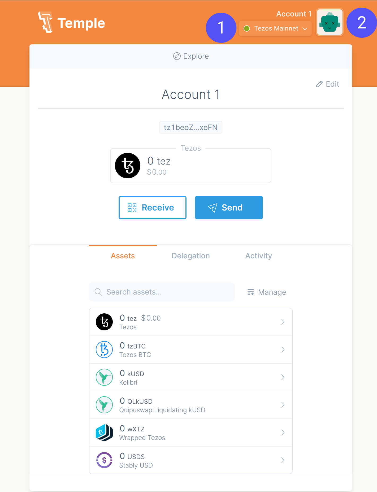
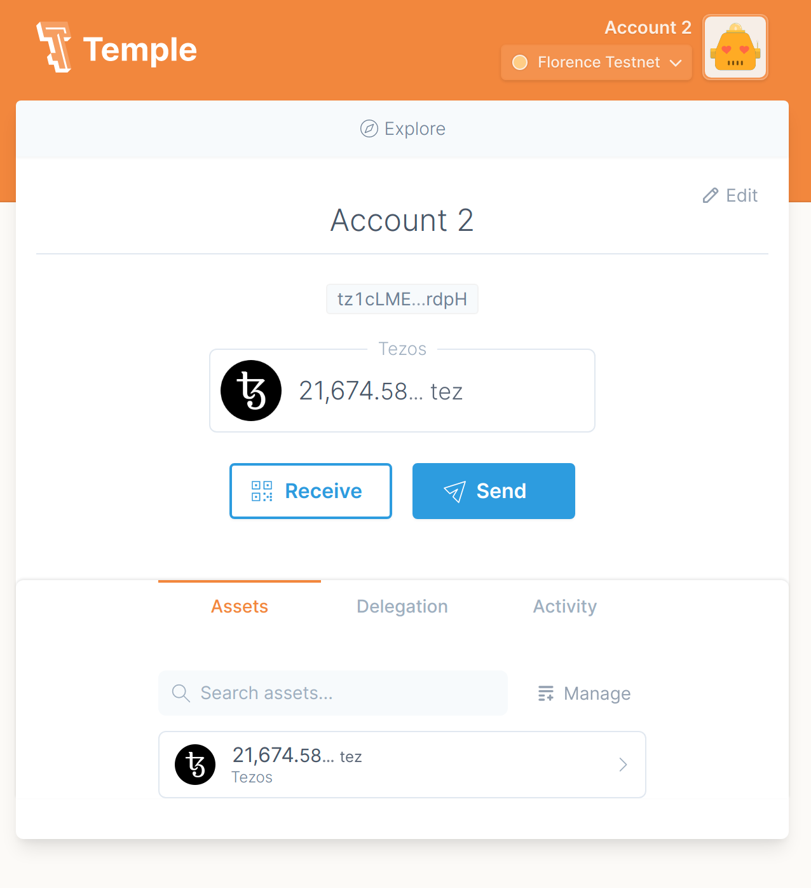
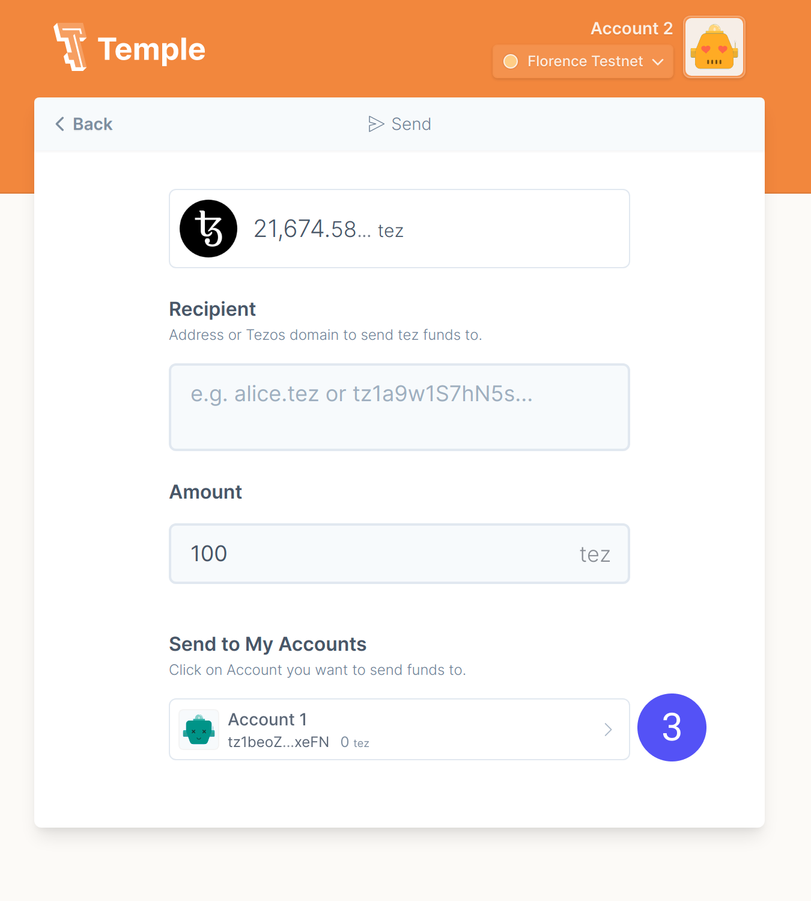
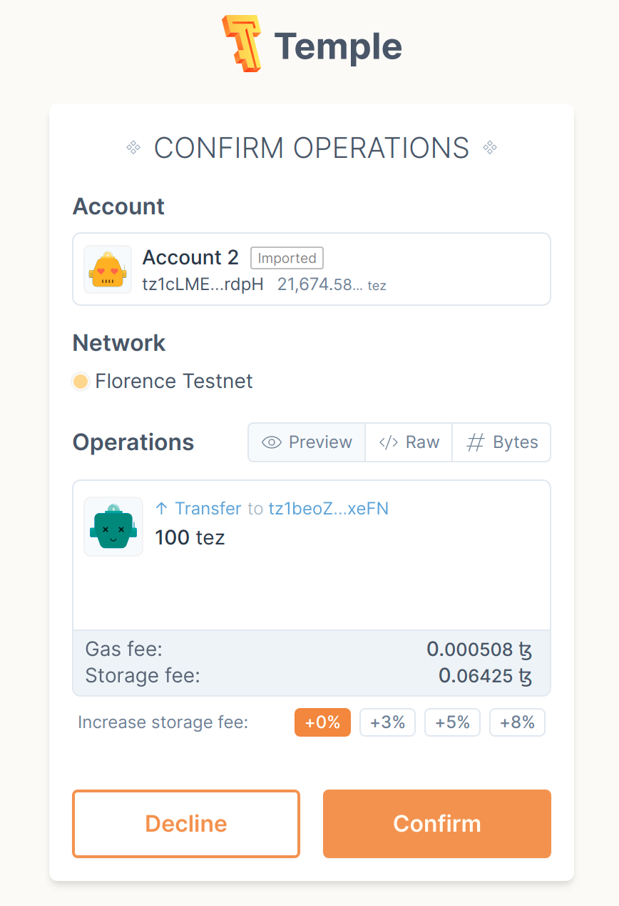

Dapp users need to have both addresses and the associated private keys of these addresses.
They want to be able to securely store their private keys, easily use and manage their addresses, and easily use the different dapps.
All of this can be performed by some tools called wallets.
They can be desktop applications, browser plugins, hardware or smart contracts...

In the case of dapps, the best option is to opt for a browser plugin.
These are easy to find and to install. 
They provide developers with a library that can be used in their dapp to connect with the user wallet.

In this chapter, we'll introduce you to the Temple Wallet, developed and maintained by _Madfish solutions_.
This first part is a tutorial about how to install and use a Temple Wallet.

# Installation

The Temple wallet plugin can be downloaded from here:

[https://templewallet.com/download](https://templewallet.com/download)

Choose your browser and add Temple to your plugins.
You will have the choice to import an existing wallet, or to create a new one.

Let's create a new wallet, choose a password and save the mnemonic phrase.

You'll get to the main page:




You should end up with an account that is activated but not funded.

# Faucet import

Let's import a faucet for the Florence network.
First, download a faucet json from [https://faucet.tzalpha.net/](https://faucet.tzalpha.net/)

Then, open the Temple Wallet.
Click on the network dropdown bar (first spot), select Florence network.
Then click on your account thumbnail (second dot), then "Import account" and finally "Faucet file".

You can load your json file. 
Once the activation is confirmed, you will automatically be redirected to the Temple main page, with your activated account.




# Send a transaction

Now that we have an account with some funds from the faucet, let's send some of them to our first account.
Click on "Send".



You can send funds to any address by manually filling the recipient.
Or you can choose from one of your addresses by clicking on the list at the bottom of the page (third spot)

Send 100 XTZ (or another amount) to your first account. 
A confirmation page will pop up. 
You can review some information on this page: transaction amount, receiver and fees.



All the transaction information can be found under the "Raw" tab:

```json
{
  "branch": "BMBg53qGc5xM42Dd3ymNV6pV1KJCJmL73T6aGfmdEmrBL6ajnfS",
  "contents": [
    {
      "kind": "reveal",
      "source": "tz1cLMENL1FJYMBJ3WPg5UQAEFobdVPFrdpH",
      "fee": "1420",
      "counter": "162232",
      "gas_limit": "10600",
      "storage_limit": "0",
      "public_key": "edpkvVNoJuAADKX3pYskzfXLpn8gBAnQjjcGQjQf22Amf9Kh4kfbnx"
    },
    {
      "kind": "transaction",
      "source": "tz1cLMENL1FJYMBJ3WPg5UQAEFobdVPFrdpH",
      "fee": "507",
      "counter": "162233",
      "gas_limit": "1527",
      "storage_limit": "257",
      "amount": "100000000",
      "destination": "tz1beoZXxjqsXGoZnwW4TZD3MWGFpLHRxeFN"
    }
  ]
}
```

Once the transaction is confirmed, you can switch to your first account (by clicking on the top-right thumbnail) and observe that your account balance has indeed increased to 100 XTZ


# Conclusion
Temple Wallet is a user-friendly wallet for Tezos. Within a few clicks, a transaction can be sent to any address.
Another benefit of using a wallet is the possibility of interacting with Dapps, this will be detailed in the next chapter.
