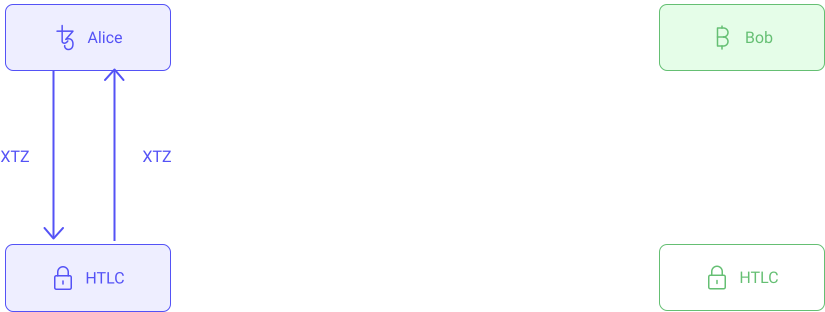

Let's consider the following scenario: Alice has 100 XTZ and wants to exchange them for 0.1 BTC from Bob. How does she proceed? There are multiple ways:

- One way is to use a centralized exchange like Binance. This means that you trust them to store your tokens and process the transaction correctly securely. But this way is built on a single point of failure that could, potentially, fail at any time. [Binance was hacked in 2019, and 7,000 bitcoins were stolen.](https://www.binance.com/en/blog/336904059293999104/Security-Incident-Recap) In addition, exchanges usually take a fee for the service they offer. Is there a better solution? Could we use a DEX instead?

<small className="figure">FIGURE 1: Illustration of non-atomic swap on a centralized exchange</small>

- DEXs are a step closer to trustless exchanges, but they are still single points of failure. Are the smart contracts secured? Can you trust their implementation? [In 2018, decentralized exchange Bancor was hacked and suffered a loss of $13.5M in assets before freezing funds.](https://www.zdnet.com/article/another-hack-rocks-cryptocurrency-trading-bancor-loses-23-5-million/) Additionally, DEXs only work within the same blockchain. _Dexter_ and _Quipuswap_ only work on Tezos with FA1.2 or FA2 tokens. So how can we exchange XTZ against BTC? One way is to use wrapped assets as seen in the [previous chapter](defi/wrapped-assets) and exchange wrapped XTZ (wXTZ) against wrapped BTC (tzBTC) on a Tezos DEX. However, you again have to trust that the smart contract that allows you to unwrap your tzBTC for actual BTC is bug-free and without malicious code. So, is there a fully trustless solution?

<small className="figure">FIGURE 2: Illustration of non-atomic swap on a decentralized exchange</small>

- A _cross-chain swap_ (also referred to as an _Atomic Swap_) refers to the action of exchanging two different cryptocurrencies in a peer-to-peer fashion without using a third party. This is possible thanks to code locking mechanisms known as **Hash Time Locked Contracts (HTLCs)** codeable into blockchain transactions. Alice and Bob can exchange their coins with one another without the help of a third party using _HTLCs_ that can interact and inform one another's actions to achieve atomicity. Alice sends her XTZ to her HTLC, which locks the funds. Bob sends his BTC to his HTLC, which also locks the funds. When both HTLCs have received the funds, they send a signal to each other, releasing the funds. Alice receives the BTC and Bob receives the XTZ at the same time, thus the atomic aspect of the operation.

//TODO: this seems like magic. How can smart contracts on two different blockchains send signals to eachother? how do we make sure the signal is not blocked in one direction, or that one arrives in time on one side but too late on the other side, allowing Alice to get Bob's BTW while getting her XTZ back? I think some idea of how this works is needed here.

<small className="figure">FIGURE 3: Illustration of an atomic swap.</small>

If Bob never sends the funds, Alice's HTLC will time-out and refund the funds to Alice automatically. 

<small className="figure">FIGURE 4: Illustration of a failed atomic swap (Bob did not send the funds).</small>

As its name denotes, HTLC is a time-bound smart contract between parties that involves the generation of a cryptographic hash function, which can be verified between them. To learn more about HTLCs, you can read [this article](https://medium.com/blockchainio/what-are-atomic-swaps-bc1d034634c9).

//TODO: reading the article, it seems like key aspects are indeed missing in the description, such as the fact that one time lock is several hours past the other one, and the contracts don't directly send signals to each other. These key aspects should be explained directly on opentezos so that it doesn't look like magic.

## Cross-chain swaps on Tezos
- [StakerBridge](https://medium.com/stakerdao/stakerbridge-eth-tez-is-live-1841cb75557d) by [StakerDAO](https://www.stakerdao.com/) is an open source, trustless method of bi-directional transfer of tokens between Ethereum and Tezos.
- [TEZEX](https://tezex.io/) is currently in development and will enable cross-chain swaps. At first, TEZEX Bridge will allow swaps of tokens between Ethereum and Tezos.

## References

[1] https://medium.com/tezosexchange/the-changemakers-of-tezex-bridge-fd73bb1d8da2

[2] https://liquality.io/blog/atomic-swaps-explained/

