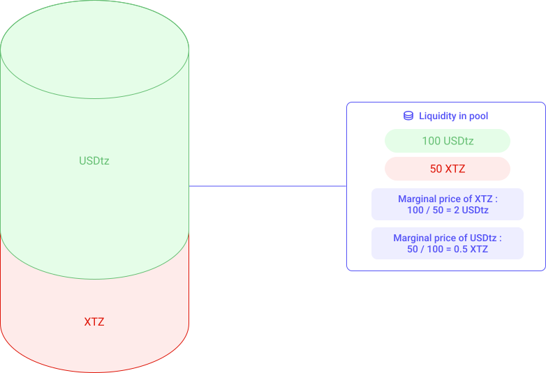
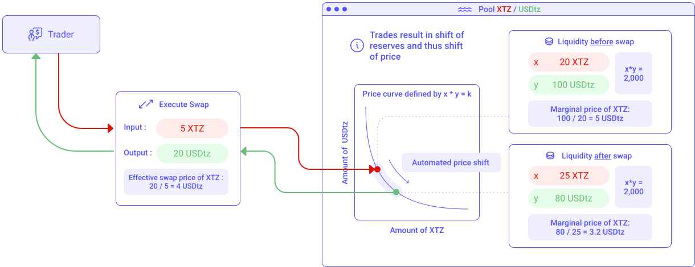

An exchange is a marketplace where coins and tokens are traded. The core function of an exchange is to ensure fair and orderly trading and the efficient dissemination of price information for any pair trading on that exchange. Exchanges give companies, traders, and crypto-enthusiasts a platform from which to publicly sell and buy crypto-currencies.
//TODO new wording proposition: Exchanges give companies, traders, and crypto-enthusiasts a platform from which they can publicly sell and buy crypto-currencies.

## Centralized Exchanges and Order Book
Before the DeFi movement, the order book model was the usual way of doing exchanges. All centralized exchanges like Coinbase and Binance are still currently based on this model. This is also the way traditional stock exchanges such as NYSE or Nasdaq work.

Simply put, traders set buy and sell orders for an asset, and the order book orders them by their prices. You can therefore trade any asset as long as there is a supply and a demand for it. 

The order book model is basically putting buyers and sellers in contact. Buyers try to buy the asset for the lowest possible price whereas sellers try to sell the asset for the highest possible price.

For a trade to happen, both buyers and sellers have to converge on a price, known as the mid-market price. This can happen by either a buyer bidding higher or a seller lowering their price.


<small className="figure">FIGURE 1: Illustration of an Order Book. Buyers and sellers are meeting at the $4.80 price point.</small>

But what happens if the gap between sellers and buyers is too large to meet at a fair market price? And what if there are not enough coins on sale to meet your demand? This is where market makers intervene.

Market makers provide liquidity to the exchange by always being willing to buy or sell at the mid-market price. Market makers essentially act as wholesalers to satisfy the market. Market makers make money with the _spread_ which is the difference between their selling price and their buying price. Spread is kept low by setting the market makers in competition with each other. Market makers also earn commissions from the exchange for providing liquidity.

## Decentralized Exchanges
### Replicating the Order Book model
Following the hacks of multiple centralized exchanges [[1]](/defi/dexs#references)
 investors started to look for alternatives. Blockchain technology is decentralized, so shouldn't exchanges be decentralized as well? At first, developers tried to reproduce the order book model [[2]](/defi/dexs#references) into a smart contract. However, this model relies heavily on market makers and they have to constantly adjust their buy and sell prices to meet the market. This results in a huge number of orders and order cancellations being sent to the exchange.

Tezos with its current throughput of 40 transactions per second and a 1 minute block time is not really a viable option for an order book exchange. On top of that, every interaction with a smart contract cost a gas fee, so market makers would go bankrupt by just updating their orders.

There was clearly a need for something new...

### Creating a new model: Liquidity Pools and Automated Market Maker (AMM)

[Uniswap](https://uniswap.org/) was the first to propose a new exchange model based on `Liquidity Pools`. In essence, a liquidity pool holds 2 tokens. For instance, XTZ/USDtz is a pool holding both XTZ tokens and USDtz tokens and enabling traders to exchange one for the other. Each pool represents additional pairs that can be traded, e.g. tzBTC/XTZ, wXTZ/USDtz, etc.

Prices for the tokens, in a pool, are simply set according to their ratios in the pool. For instance, let's imagine a XTZ/USDtz pool represented _FIGURE 2_ with 100 USDtz and 50 XTZ. The price of 1 XTZ would be 100/50 = 2 USDtz. In returns, the price of a 1 USDtz would be 50/100 = 0.5 XTZ.


<small className="figure">FIGURE 2: Pricing of tokens in a liquidity pool</small>

So what happens when a trader wants to swap 10 USDtz for some XTZ? Considering the pool represented _FIGURE 3_ which currently has 100 USDtz and 50 XTZ. The price of 1 XTZ is 2 USDtz as seen previously. The trader would therefore receive 5 XTZ from the pool in exchange for his 10 USDtz.

Now notice that the reserves in the pool have changed. The pool now has 110 USDtz and 45 XTZ. The price for 1 XTZ is therefore changed and is now 110/45 = 2.4 USDtz.


<small className="figure">FIGURE 3: Illustration of a token Swap</small>

This is why liquidity pools are also known as _Automated Market Maker_ (AMM) because the price is automatically set based on the amount of tokens currently available in the pool (and not by some arbitrary order book which represents potential order and not actual liquidity). Prices in pools follow a curve given by the equation:

```
 x * y = k
```
 where:
 - x is the quantity of a the first token in the pool (e.g. USDtz)
 - y is the quantity of a the second token in the pool (e.g. XTZ)
 - k is a constant

_FIGURE 3_ shows the shape of such a curve. Notice it is asymptotic to infinity in each direction. An asymptote curve is a line that continually approaches the curve but never meets it at any finite distance. The distance between the line and the curve approaches zero as they tend to infinity. (When we say variable n tends to infinity, means as n gets very very large.) Therefore a liquidity pool will always offer an exchange rate, even when it is very large, as one token can never reach zero.

Notice also that the more liquidity a pool has the less the price is affected by swaps. Indeed, suppose that in the previous scenario the pool instead was 100,000 USDtz and 50,000 XTZ. If a trader exchanges 10 USDtz for 5 XTZ, the new reserves are 100,010 UDtz and 49,995 XTZ. The new price of XTZ is 100,010/49,995 = 2.0004 USDtz. The price has barely moved! Just like for centralized exchanges, liquidity providers (LP) play an essential role by providing liquidities to pools-in in order to stabilize the price. 

When a new pool is created, the first liquidity provider is the one that sets the initial price of the assets in the pool. The liquidity provider is incentivised to supply an equal value of both tokens to the pool. If the initial price of the tokens in the pool diverges from the current global market price, it creates an instant arbitrage opportunity that can result in lost capital for the liquidity provider. 

Arbitrage is when the price offered by the pool diverges from the price offered for the same pair on other platforms. In our example, the price of XTZ is 2 USDtz. Now suppose that XTZ are being traded everywhere else at 5 USDtz. Arbiters will therefore immediately buy XTZ from our pool at 2 USDtz and resell it on other platforms at 5 USDtz making profits in the process. This process will keep going until the reserves in our pool shits sufficiently to align with the rest of the market at 5 USDtz per XTZ.

Liquidity providers need, therefore, always provide liquidity at the current market rate of the pair. 

When liquidity is supplied to a pool, the LP receives special tokens called LP tokens in proportion to how much liquidity they supplied to the pool. When a swap occurs in the pool, an 0.3% fee is proportionally distributed amongst all the LP token holders. If the liquidity provider wants to get their underlying liquidity back, plus any accrued fees, they are required to burn their LP tokens.


<small className="figure">FIGURE 4: How liquidity providers are rewarded</small>

## Conslusion

The concepts behind liquidity pools and automated market making are quite simple yet extremely powerful as there do not need centralized book-orders anymore. The only obstacle to the development of liquidity pools remains some high gas fees and execution time, but as gas fees are reduced and transactions made faster with each amendment of Tezos, liquidity pools should soon become the main way of trading on Tezos.

## Liquidity pools on Tezos

- [Dexter](https://dexter.exchange/)
- [Quipuswap](https://quipuswap.com/)

## References

[1] https://selfkey.org/list-of-cryptocurrency-exchange-hacks/

[2] https://thecontrol.co/a-comparison-of-decentralized-exchange-designs-1deef249f56a

[3] https://finematics.com/liquidity-pools-explained/
