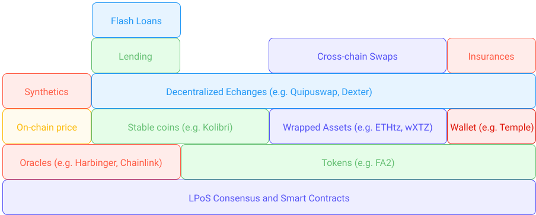

import NotificationBar from '../../src/components/docs/NotificationBar';

## What is _DeFi_?
_DeFi_ is an acronym of **De**centralized and **Fi**nance :

* The word _Finance_ refers to all the traditional financial tools and services that exist since antiquity, such as buying or selling currencies, transferring, borrowing, lending money, trading, betting, insuring, etc.

* The word _Decentralized_ refers to the structure of blockchain and how each protocol runs on a multitude of servers (or nodes) worldwide, guaranteeing peer-to-peer, quick, synchronized, uncensorable, immutable, and non-retractable transactions. Moreover, these transactions are visible, transparent, and auditable by anyone. 

Mixing these two allows for the re-creation of financial services previously only available through banks, centralized exchanges, insurance companies, etc.
Although the DeFi movement started as the reproduction of the existing centralized financial models in a decentralized manner (i.e., smart contracts reproduced the order book model), it soon shifted to the creation of new opportunities that were available thanks to the decentralized nature of the blockchain (i.e., smart contracts creating [_automated market markers_](/defi/dexs)) and thus impossible to reproduce in traditional finance.

The objective of DeFi is to create added financial value accessible to everyone, decentralized, instantaneous, transparent, and to cut out the middlemen to execute transactions, create and manage savings, trade, and obtain returns on financial assets with no need for a central authority.

DeFi tools and services are often compared to `Money Bricks` [[1]](/defi/introduction#references). Instead of creating an isolated software from the ground up as banks do, DeFi tools and services usually take advantage of the whole ecosystem in place and integrate themselves within them just like bricks would with each other. For instance, decentralized exchanges (_DEXs_ for short) rely on tokens, stable coins, and oracles, which themselves rely on smart contracts and blockchain consensuses. Additionally, we find DeFi apps built on top of other DeFi apps, e.g., swapping apps, yield farming, lending, insurances, etc., built on top of DEXs.
Like bricks, DeFi applications can layer on top of each other and build the foundation needed to create completely decentralized financial layers — cutting out the middle man (banks, insurance companies, etc.) to reduce the costs and make the service more inclusive.

<small className="figure">FIGURE 1: Illustration of DeFi as <i>Money Bricks</i> (in no particular order).</small>

## DeFi on Tezos

In this module, we are going to learn more about the main areas where DeFi has been revolutionizing finance [[2]](/defi/introduction#references) and what solutions have been or are currently being developed on Tezos. Mainly:

[Token Standards](/defi/token-standards): Tokens represent a way to exchange value, e.g., money, collectibles, tokenized estate. A token standard ensures that all smart contracts implementing it are compatible with each other. **On Tezos**: The latest token standard is [FA2](https://gitlab.com/tzip/tzip/-/blob/master/proposals/tzip-12/tzip-12.md) (standing for _Financial Application 2_) and it supports a wide range of token types: fungible, non-fungible, non-transferable, as well as multi-asset contracts. 

[Decentralized Exchanges](/defi/dexs): This type of exchange refers to one which enables the trading of various digital assets in a peer-to-peer form. This form bypasses the need for an intermediary or a centralized, single party. **On Tezos**: You can trade _tez_ and related _FA2_ supported assets on [Dexter](https://dexter.exchange/) and [Quipuswap](https://quipuswap.com/). 

[Wrapped Assets](/defi/wrapped-assets): A wrapped asset is one that allows the trading and exchange of an asset from a different blockchain network to the one in which it is wrapping itself into. For instance, you cannot trade native BTC on Tezos. However, it is possible to wrap BTC into an _FA2_ token (such as [tzBTC](https://tzbtc.io/)) that is stable in price compared to BTC and fully compatible with the Tezos network. **On Tezos**: We've seen the addition of [Wrapped XTZ (wXTZ)](https://medium.com/stakerdao/the-wrapped-tezos-wxtz-beta-guide-6917fa70116e), [Wrapped Bitcoin (tzBTC)](https://tzbtc.io/), [Wrapped ETH (ETHtz)](https://decrypt.co/51860/wrapped-eth-comes-to-tezos-as-it-takes-on-ethereum-defi-market) and the addition of over 20 ERC-20 assets from [Bender Labs](http://www.benderlabs.io/) coming in the [near future](https://cryptoslate.com/20-ethereum-erc-20-tokens-will-be-coming-to-tezos-xtz-defi-in-q1-2021/).

[Cross-Chain Swaps](/defi/cross-chain-swaps): A _cross-chain swap_ (also referred to as an _Atomic Swap_) refers to the action of exchanging two different cryptocurrencies in a peer-to-peer fashion without using a third party. This is possible thanks to the ability to code locking mechanisms known as **Hash Time Locked Contracts (HTLCs)** into blockchain transactions. **On Tezos**: [TEZEX](https://tezex.io/) is currently in development and will enable cross-chain swaps.

[On-Chain Oracles](/defi/oracles): By default, a Tezos smart contract cannot receive any data from outside the blockchain. **Oracles**, therefore, offers to fetch data from off-chain sources and make it available on-chain. Information such as price and much more can be obtained and trusted - through the amalgamation of multiple price feeds. **On Tezos**: [Harbinger oracles](https://medium.com/@Blockscale/introducing-harbinger-a-self-sustaining-price-oracle-for-tezos-7cab5c9971d) provide this service as well as Kaiko. A [Chainlink integration](https://www.coindesk.com/tezos-blockchain-chainlink-oracle-services) is expected in the near future by the SmartPy team. 

[Stablecoins](/defi/stablecoins): A **stablecoin** is a cryptocurrency whose price is fixed to another asset. Most stablecoins are pegged (fixed) to fiat currencies (currencies issued by a central bank) like the US Dollar. **On Tezos**: The [Kolibri (kUSD)](https://kolibri.finance/) stablecoin is currently available on the testnet and the [Stably (USDS)](https://www.stably.io/), which is available on the mainnet, is fully backed by fiat reserves and regulated by _Prime Trust_. 

[Synthetics](/defi/synthetics): Synthetics are contracts between two parties that both bet on an opposite outcome for the value of an asset and make profits or losses on the outcome. The actual asset is not purchased in this contract. The is particularly interesting for assets that have very low liquidity, are hard to transact, or are not available to trade. **On Tezos**: [_SEXP_](https://www.publish0x.com/publish0x-posts/sexp-a-tezos-based-synthetic-exchange-xmkjjzq) is a synthetics exchange on Tezos currently in development.

[Lending and flash loans](/defi/lending): Loans allows you to borrow or lend tokens to someone in exchange of interests. **On Tezos**: Projects for lending are currently in development, including [Tezos Finance (aka "Tezfin")](https://tezos.finance/)

## References

[1] https://medium.com/coinmonks/the-building-blocks-of-decentralized-exchanges-on-defi-explained-5cd6756bd3e9

[2] https://wiki.tezosagora.org/learn/uses-of-tezos/defi

[3] https://www.latribune.fr/opinions/tribunes/qu-est-ce-que-la-defi-cette-finance-decentralisee-prete-a-changer-les-regles-du-jeu-858938.html
