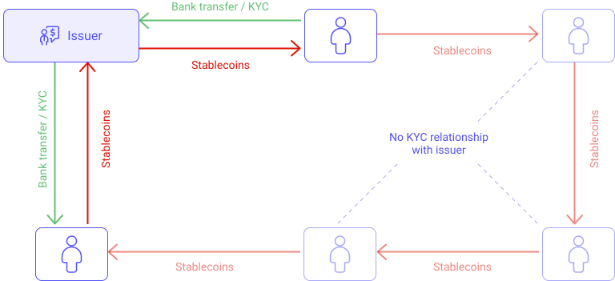

A **stablecoin** is a cryptocurrency whose price is fixed to another asset. Most stablecoins are pegged (fixed) to fiat currencies (currencies issued by a central bank) like the US Dollar. 

<small className="figure">FIGURE 1: Illustration of a stablecoin volatility compared to his pegged asset (e.g. USD).</small>

Stablecoins have gained traction as they attempt to offer the best of both worlds: the instant processing, security and privacy of cryptocurrencies, and the **volatile free** stable valuations of fiat currencies.

## How it works?
Stablecoins achieve their price stability via **collateralization** (backing) or through **algorithmic mechanisms** of buying and selling the reference asset or its derivatives. There are 3 types of stablecoins:

### Fiat-Collateralized Stablecoins
#### Principle
Fiat-collateralized stablecoins are backed by centralized entities that guarantee an exchange rate at the same price as the asset (minus potential fees). They mint new stablecoins when they receive fiat and burn stablecoins when they giving back fiats. These centralised entities guarantees that you can always exchange 1 stable-USD against 1 USD, and the other way around. These entities are regularly audited to guarantee that they always have enough reserves to meet the demand. However, these entities are single points of failures and they are not decentralised.

#### Example
If Alice want wants 100 stable-USD, she needs to send 100 USD to the bank account of the entity. The entity will in turn mint 100 stable-USD and send it to Alice. Note that to exchange with these entities, you will need to pass a [KYC](https://en.wikipedia.org/wiki/Know_your_customer) (Know-Your-Customer) as illustrated in Fig. 2. Alice can then use the stable-USD for any operation such as sending them to Bob. Bob may then want to exchange the 100 stable-USD against some USD. Bob passes a KYC with the entoty and then send them the 100 stable-USD. The company burns the tokens and send 100 USD from their bank account to Bob's bank account.

#### Risks
An shown above, it is important that these entities keep as much USD in their bank account as they mint stable-USD. A malicious company could spend or invest the USD from the bank account and then not be able to pay back users in case of a massive exchange of stable-USD to USD. (Note that the problematic is similar to the practice of _fractional reserve banking_ as presented [in the first module](/blockchain-basics/introduction).)

<small className="figure">FIGURE 2: Exchanging stable coins against fiat currencies (or the other way around) is secured by a KYC. Exchanging stable coins between users do not require a KYC (i.e. as long as its stays inside de crypto world)</small>

### Crypto-Collateralized Stablecoins
Crypto-collateralized stablecoins are backed by other cryptocurrencies. The stablecoins are minted or burned by automated smart contracts, making them fully decentralised. However, since the reserve cryptocurrency may also be prone to high volatility, such stablecoins are "over-collateralized", meaning a much larger number of cryptocurrency tokens is maintained as reserve, compared to the provided stablecoins. These are not capital efficient.

#### Example
/// IN PROGRESS

#### Risks

### Non-Collateralized (algorithmic) Stablecoins
Non-collateralized stablecoins don’t use any reserve but rely on an algorithm that will automatically burn tokens when supply is high to increase the price, or mint new tokens when supply is low to decrease the price, much like central banks are doing to maintain valuations of a fiat currency. It can be achieved by implementing a smart contract on a decentralized platform that can run in an autonomous manner.

#### Example

#### Risks

<small className="figure">FIGURE 3: Recapitulation of the 3 types of stablecoins.</small>

## On Tezos
- [Kolibri (kUSD)](https://kolibri.finance/), currently only on the testnet.
  
- [Stably (USDS)](https://www.stably.io/), which is available on the mainnet and is fully backed by fiat reserves and regulated by _Prime Trust_, a Nevada-chartered trust company that also acts as the regulated administrator of USDS. 

There are currently no crypto-collateralized or algorithmic stablecoins on Tezos.

## References
[1] https://www.investopedia.com/terms/s/stablecoin.asp

[2] https://kolibri.finance/

[3] https://www.stably.io/

[4] https://medium.com/@MakerDAO/single-collateral-dai-source-code-and-security-reviews-523e1a01a3c8