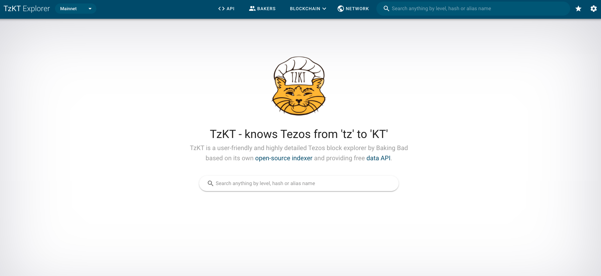

// TODO: Intro. What is this chapter about?

## Nomadic Labs Indexer

// TODO: Intro about this indexer. Is this the official indexer?

<small className="figure">FIGURE 1: GitLab Nomadic Labs Indexer</small>

- Source code : [Gitlab](https://gitlab.com/nomadic-labs/tezos-indexer)

**Pros**
- made by the Tezos core team
- same data structures as Tezos node

**Cons**
- ETL only, no API server // TODO: What is ETL? This has not been defined yet in the module progression (or move this chapter later)
- requires a Postgres database
- limited data, no contracts // TODO: No contract what? No contract data? What does limited mean here?

> **Postgre server impacts speed performance**.
> The trade off of Postgres server is that for each index 
> you have you will insert data at a slower pace. 
> Essentially when you insert your data with an index 
> it must write data to two places as well as maintain the sort on the index as you insert data

## Cryptonomic Conseil

// TODO: Intro. When was it build? Is it up to date?

<small className="figure">FIGURE 1: Arronax Explorer</small>

- Source code : [Github](https://github.com/Cryptonomic/Conseil)
- Explorer website : [Arronax.io](https://arronax.io/)

**Pros**
- indexer and API server
- full-text search in contracts & storage and smart filter

**Cons**
- requires a Postgres database
- verbose query language // TODO: why?
- limited statistics and timeseries data // TODO: What does limited mean here?

## Baking Bad TzKT Indexer

// TODO: Intro. Who is Baking bad? Is this from a grant? When? 

<small className="figure">FIGURE 1: TzKT Explorer</small>

- Source code : [Github](https://github.com/baking-bad/tzkt)
- Explorer website : [TzKT.io](https://tzkt.io/)

**Pros**
- split design: ETL, API // TODO: Meaning we have to choose which one we want?
- mempool support // TODO: Useful for what?

**Cons**
- requires a Postgres database
- requires Microsoft Toolchain
- no smart contract support (yet)
- no time-series data

## Blockwatch TzIndex / TzStats

// TODO: Intro. Is this the most popular explorer? Maybe place it on top of the list? 

<small className="figure">FIGURE 1: TzStats Explorer</small>

- Source code : [Github](https://github.com/blockwatch-cc/tzindex)
- Explorer website : [TzStats.com](https://tzstats.com/)

**Pros**
- speed
- stand-alone, no database needed
- Michelson decoding and full Bigmap support
- time-series and table APIs

**Cons**
- no mempool support
- no full-text search
