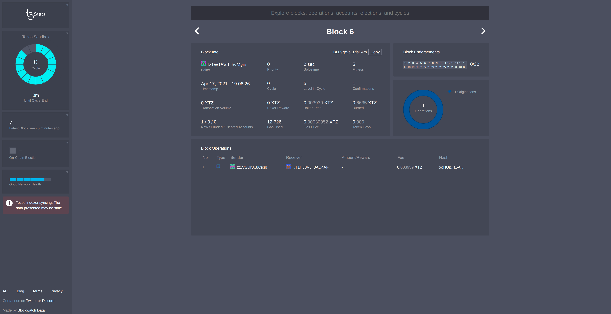
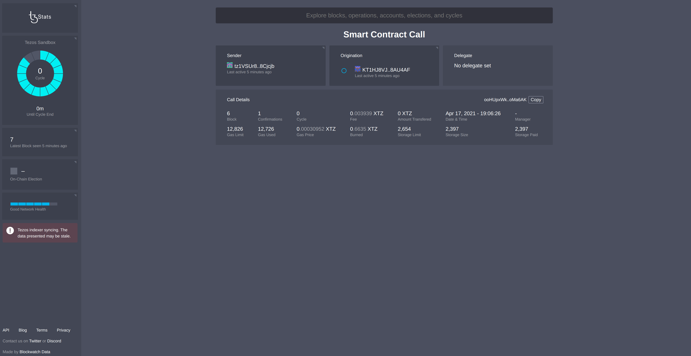
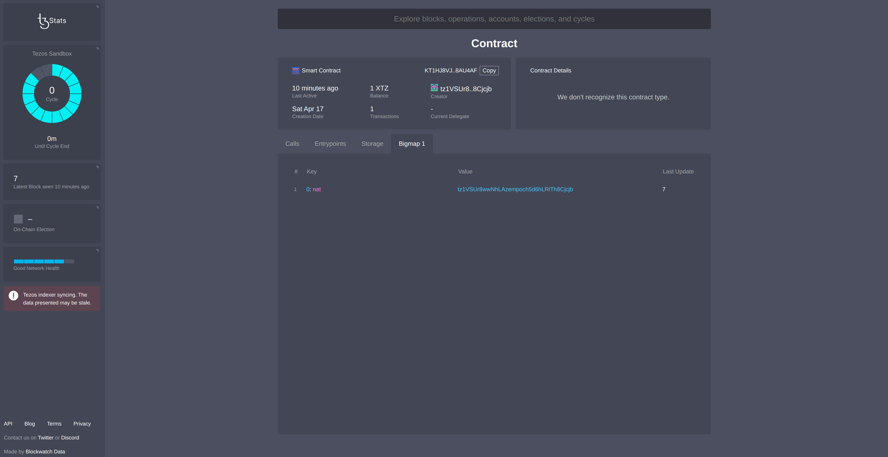

The tools presented in this module so far are fully public, meaning that everyone can use them. However, they are meant for public networks, and the user is dependent on the infrastructure and configuration of these services. Some organizations are more interrested in deploying their own private Tezos network, either for private testing before going public, or for entirely private use. Refer to the [Private blockchain module](/private) for more info. Therefore, it must be possible to use an indexer on private networks.

Fortunately, all public developments on Tezos are open-source and can easily be adapted for a private network, e.g. an indexer can be deployed and configured to watch a private network.

In this chapter, we will see how the source code of _TzIndex_ and _TzStats_ can be used to make a private indexer, either for use on a private network or a public network.

This chapter is divided into three parts:
- how to quickly set up a private network.
- how to install and configure these tools
- how to use them

# Prerequisites
To index a private network, a few things are needed:
- a private tezos network
- accounts
- a smart contract
- operations


First, a private network has to be set up. 
The quickest way to set up a private Tezos network is to use Ganache (see the [Build a Dapp module](/dapp) for more details).
Ganache is a npm module, that can set up a personal private network.
Ganache provides 10 accounts when it starts, displayed in the logs.

The raffle smart contract, developed in the LIGO module, will be used. 
It will be migrated onto our private network with the _Truffle_ configuration detailed in the [Build a Dapp module](/dapp).

## Installing the prerequisites
A github repository is available here:
[https://github.com/bepi-octo/raffle-smart-contract.git](https://github.com/bepi-octo/raffle-smart-contract.git)

It contains a ganache configuration (with predefined accounts), three smart contracts, and their associated migration:
1. a dummy smart contract, with a big map as storage
2. a raffle smart contract, using a big map
3. a raffle smart contract, using a map

```shell
$ git clone https://github.com/bepi-octo/raffle-smart-contract.git
$ cd 
$ npm install -g truffle@tezos
$ npm install 
```

_Tzindex_ is written in Go. It can be installed go by following the instructions at:
[https://golang.org/doc/install](https://golang.org/doc/install)

There are also docker images. It can be installed Docker by following the instruction at:
[https://docs.docker.com/get-docker/](https://docs.docker.com/get-docker/)
## Launching a private tezos network
In the package.json, one script is defined:
```json
  "scripts": {
    "start-sandbox": "ganache-cli --flavor tezos --seed alice"
  }
```

> There are several versions of the ganache-cli. 
> Only the version suffixed by '-tezos' supports tezos blockchain.
> The version used by the project can be found in the  "devDependencies" section, in the package.json file.


This script starts up a private Tezos blockchain, with _ganache_:

```shell
$ npm run start-sandox
Ganache CLI v6.12.1-tezos.0 (ganache-core: 2.13.2-tezos.2)

Available Accounts
==================
alice 100 TEZ
  pk: edpkvGfYw3LyB1UcCahKQk4rF2tvbMUk8GFiTuMjL75uGXrpvKXhjn
  pkh: tz1VSUr8wwNhLAzempoch5d6hLRiTh8Cjcjb
bob 100 TEZ
  pk: edpkurPsQ8eUApnLUJ9ZPDvu98E8VNj4KtJa1aZr16Cr5ow5VHKnz4
  pkh: tz1aSkwEot3L2kmUvcoxzjMomb9mvBNuzFK6
eve 100 TEZ
  pk: edpku9qEgcyfNNDK6EpMvu5SqXDqWRLuxdMxdyH12ivTUuB1KXfGP4
  pkh: tz1MnmtP4uAcgMpeZN6JtyziXeFqqwQG6yn6
mallory 100 TEZ
  pk: edpkujwsG5JMrWVXQwmRMBoR9yJkokRbn6wy3monpQKBpnZTs1ogRR
  pkh: tz1R2oNqANNy2vZhnZBJc8iMEqW79t85Fv7L
trent 100 TEZ
  pk: edpkukjpYWLPEavoTXid8KqfYAY4J1rqtbWHWrzp22FgdRQqzaRkDD
  pkh: tz1TfRXkAxbQ2BFqKV2dF4kE17yZ5BmJqSAP
marketa 100 TEZ
  pk: edpktiaGKkt8Yu6m4Gse2GhMdJCVdCtcrjtqATn3y3sf7xTBDj5g2a
  pkh: tz1fhigafd7PQAh3JBvq7efZ9g6cgBkaimJX
eulalie 100 TEZ
  pk: edpkvCvic2obeedM7oMJaeyapEafg4dSdYuWvkZigKbcvc64q6ZKM7
  pkh: tz1fEqJ6rD3mfQjVat7G6XJP522V6V8wWTP2
stella 100 TEZ
  pk: edpkvRuciP6vZeoXn1KJtBuEEtaD2SpHW59wbbCGt1SEDBL94W7AUE
  pkh: tz1i3eqdPNs9zjpavVBFcF8JarJUgEErfsUK
carline 100 TEZ
  pk: edpktxefxf3dtJEQLVb72MjV8yMiLh6DfCgNJQUV81rnsYJoZhbnK8
  pkh: tz1PQP815EzZRktgLaEhtDCR22kiRrcQEurw
tabbie 100 TEZ
  pk: edpkvXobE6tQLdsm3kPu3MYT2z2XrgVchfkK2WPB9tniNXdWSRyud3
  pkh: tz1WP3xUvTP6vUWLRnexxnjNTYDiZ7QzVdxo

<...>
```

A private network has started, with funded accounts that will be used in this article.

## Migrating the raffle contract

The contract can be migrated onto the private network. 
More details can be found about the _Truffle_ tool in the Dapp section (link to chapter).

First, the private network has to be defined in the _truffle-config.js_ file.
A `development` subsection should be found under the `networks` section:
```json
    development: {
      host: "http://localhost",
      port: 8732,
      network_id: "*",
      secretKey: alice.sk,
      type: "tezos"
    }
```
<br/>
The used account is defined in the scripts/sandbox/account.js file.
The contracts can now be migrated:

```shell
$ truffle migrate --network development
```

Three contracts are deployed onto our private network:
1. the first contract holds a big map, and does not do anything.
This dummy contract is deployed to bypass a _tzstats_ bug regarding big maps: 
the first big map (whose index is 0) is not fetched by the frontend.
2. a raffle contract using map
3. a raffle using big map

For the second and third migrations, a raffle is opened (given the storage definition), 
and the account used for the migration has bought a ticket.

> The same smart contract is deployed twice: one with maps, and the other with big maps.
> Later on, these two smart contracts will a highlight the difference between the processing of maps and big maps by _tzstats_.

# Setting up a private _tzindex_ (backend)

_Tzindex_ is an open-source indexer: it can freely be used and modified.
The source code is available here: [https://github.com/blockwatch-cc/tzindex](https://github.com/blockwatch-cc/tzindex)

The application is built this way:
```shell
$ git clone https://github.com/blockwatch-cc/tzindex
$ cd tzindex
$ make build
$ ls tzindex
tzindex

```
A _tzindex_ binary is created into the directory.
The indexer can now watch the private network with this command:
```shell
$ ./tzindex run --rpcurl 127.0.0.1:8732 --notls --enable-cors
```

- --rpcurl: url of the ganache private network rpc node
- --notls: this option is used since ganache is exposing with http
- --enable-cors: used for the frontend (_tzstats_)

_Tzindex_ will expose its API over http://localhost:8000.

A db/ folder is created when launching _tzindex_ for the first time: 
it contains all the data indexed about the private network. 

> When restarting ganache, a blank new network is created. 
> The db/ folder, containing the old date, have to be removed, in order to make _tzindex_ index the new network.

# Setting up a private _tzstats_ (frontend)

_Tzstats_ is an open-source frontend, meant to display data from _tzindex_.
The source code is available here: [https://github.com/blockwatch-cc/tzstats](https://github.com/blockwatch-cc/tzstats)

This frontend works with _tzindex_: 
_Tzstats_ can interact with _tzindex_ by setting the TZSTATS_API_URL variable
The application can be launched with:
```shell
$ git clone https://github.com/blockwatch-cc/tzstats
$ cd tzstats
$ echo 'TZSTATS_API_URL=http://localhost:8000' > development.env
$ npm install
$ yarn start
```

> An error might occur during the npm install. 
> If so, modifying the `sass` field under the `scripts` in the package.json file solves the issue:
> ```json
> "sass": "npx sass src/styles/scss/index.scss:src/styles/css/index.css"
> ```
> The `npm install` command has to be run again

A new page should open in a web browser.

# Interactions with the private explorer

At this point, the  working context is:
- a private network running, through Ganache
- three migrated contracts
- two contract calls 
- _tzindex_, indexing the private network
- _tzstats_, connected to _tzindex_, and running

So, there has already been some activity within the private network. 

## Watch activity from _tzstats_

_Tzstats_ is running at http://localhost:3000: 


The frontend is different from the public [tzstats.com](https://tzstats.com/), but the same pieces of information are displayed


In the top-center, there is a search bar where anything can be looked for:
transactions, blocks, addresses...

On the left panel, various pieces of information are displayed.
One of them is going through each baked block. 
The number of block can be clicked.

So far, four blocks have been baked:


All block details are displayed, many of them can be clicked.
This block only contains one operation, which is a smart contract call.
The hash can be clicked, the operation page opens up.



The sender does match alice pkh from the scripts/sandbox/account.js (in the _Truffle_ project).
The contract address does also match the returned address from the migration.

The contract can be inspected by clicking on its address:


All the pieces of information can be found here: the history of calls, the entrypoints, the storage...
The two calls made by _Truffle_ are displayed: the origination of the contract, and the purchase of a ticket.

The storage page displays all the pieces of data of the smart contract: the storage definition, the type of each field,
the data held in each one of them.
Below is the smart contract storage after the migration: one participant is registered, 
and the contract holds one XTZ (ticket price).


### About big maps
However, the *sold_tickets* big map should hold an `address` as value, but it displays `1` in the storage.
Since big maps are meant to hold unbounded lists of data, it is not loaded directly into the storage, out of performance concern.
Each big map is indexed: the number `1` that is seen is the big map number.
The data can be accessed by clicking on the "Bigmap 1" section.



If maps (meant for limited data size) are used, the data is directly retrieved in the storage section.
It can be seen in the second migrated data storage for instance (baked in the fourth block):


The _tzstats_ interface is very user-friendly, all kind of information can be easily read by clicking on element.
All these pieces of information are of course retrieved from the indexer: _tzstats_ just displays them.

## Watch activity from _tzindex_

The same pieces of information can be retrieved by just using the API, without the frontend.
On each page, an API call is made: each one of these API calls can be seen in the network explorer.
The network explorer can be opened by pressing F12, in the network section


The _request URL_ gives the API endpoint to call:

```shell
$ GET http://127.0.0.1:8000/explorer/contract/KT1HJ8VJ9rHkoi4FfzHPburSe1VdYn8AU4AF?
{
  "address": "KT1HJ8VJ9rHkoi4FfzHPburSe1VdYn8AU4AF",
  "manager": "tz1VSUr8wwNhLAzempoch5d6hLRiTh8Cjcjb",
  "delegate": "",
  "height": 6,
  "fee": 0.003939,
  "gas_limit": 12826,
  "gas_used": 12726,
  "gas_price": 0.30952,
  "storage_limit": 2654,
  "storage_size": 2397,
  "storage_paid": 2397,
  "is_funded": true,
  "is_vesting": false,
  "is_spendable": false,
  "is_delegatable": false,
  "is_delegated": false,
  "first_in": 7,
  "first_out": 0,
  "last_in": 7,
  "last_out": 0,
  "first_seen": 6,
  "last_seen": 7,
  "delegated_since": 0,
  "first_in_time": "2021-04-17T17:06:27Z",
  "first_out_time": "0001-01-01T00:00:00Z",
  "last_in_time": "2021-04-17T17:06:27Z",
  "last_out_time": "0001-01-01T00:00:00Z",
  "first_seen_time": "2021-04-17T17:06:26Z",
  "last_seen_time": "2021-04-17T17:06:27Z",
  "delegated_since_time": "0001-01-01T00:00:00Z",
  "n_ops": 1,
  "n_ops_failed": 0,
  "n_tx": 1,
  "n_delegation": 0,
  "n_origination": 0,
  "token_gen_min": 1,
  "token_gen_max": 1,
  "bigmap_ids": [
    1
  ],
  "op_l": 3,
  "op_p": 0,
  "op_i": 0,
  "iface_hash": "d30a2146",
  "call_stats": [
    1,
    0,
    0
  ]
}


```

It gives a lot of information: some pieces are displayed on the page (such as the address).
However, others are missing. For instance, the storage data is not fetched.
Another API call has to be made:

```shell
$ GET http://127.0.0.1:8000/explorer/contract/KT1HJ8VJ9rHkoi4FfzHPburSe1VdYn8AU4AF/storage?
{
  "meta": {
    "contract": "KT1HJ8VJ9rHkoi4FfzHPburSe1VdYn8AU4AF",
    "time": "2021-04-17T17:06:27Z",
    "height": 7,
    "block": "BLwCojKb2fv7Ph88kxMoYXeTRYdtavvzCNh3ZzsJNpfFgqq5ey8"
  },
  "value": {
    "admin": "tz1cGftgD3FuBmBhcwY24RaMm5D2UXLr5LHW",
    "close_date": "1618679185827",
    "contract_name": "Raffle smart contract with big map",
    "description": "",
    "jackpot": "100",
    "players": [
      "tz1VSUr8wwNhLAzempoch5d6hLRiTh8Cjcjb"
    ],
    "raffle_is_open": "true",
    "sold_tickets": "1",
    "winning_ticket_number_hash": "00"
  }
}

```

All the available endpoints can be found here: [https://tzstats.com/docs/api#explorer-endpoints](https://tzstats.com/docs/api#explorer-endpoints)

# Setting up a private indexer for a public network

Public networks can be also be monitored with a local indexer.
It just has to monitor a node: either a local node, or to use a public node (listed here: [https://tezostaquito.io/docs/rpc_nodes/](https://tezostaquito.io/docs/rpc_nodes/))

```shell
$ ./tzindex run --rpcurl <node_url> --notls --enable-cors
```

There are three operations operation modes, which retrieve more or less data:
- Full regular: all indexes are built (default)
- Light light-weight: consensus and governance indexes are not built (CLI: --light)
- Validate: state validation mode for checking accounts and balances each block/cycle (CLI: --validate)

Whatever the operation mode is, the indexing of a public network will take much more time than the example above.

# Conclusion

Running a private network does not mean being blind to what is going on the network:
private indexers and explorers can be set up to monitor what is going on a private network.

These private tools can also be used to monitor public networks, 
even if public tools are already set up to that purpose.

Finally, indexers can come in handy as additional tools to librairies (such as [Taquito](https://tezostaquito.io/)) or wallet (as described in the [Build a Dapp module](/dapp)).
Indeed, big maps are not easily handled with those tools.
For instance, it is not possible to retrieve all the keys of a big map.
However, indexers solve this issue with a simple REST call.