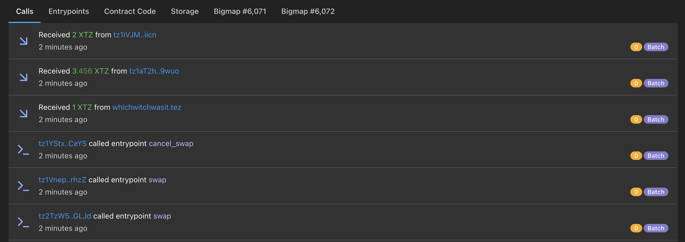
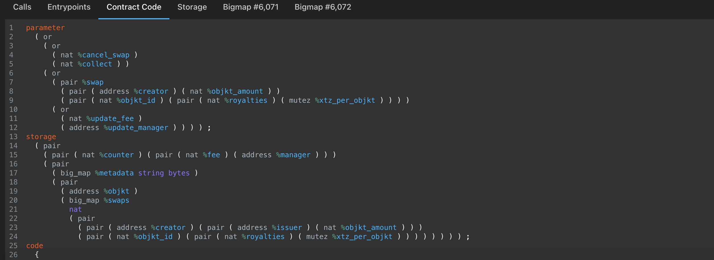

As a developer, you will often want to check the state of your deployed smart contracts. Using a blockchain explorer is a fast and easy way to do so. In this section, we will deploy a smart contract and check it out on _TzStats_.

## Step 1: Deploy your smart contract
We are going to re-use the [raffle smart contract from the LIGO module](/ligo/contracts-ligo) and deploy it on a testnet.

The complete source code of the raffle contract can be found [here](https://github.com/bepi-octo/raffle-smart-contract.git).

It contains two smart contracts and their associated migrations:
1. a raffle smart contract, using a _big map_
2. a raffle smart contract, using a _map_

The current testnet at the time of writing is _Edonet_. The account used for deployment is defined in the _truffle_ config (refer to the [How to build a Dapp module](/dapp) for more info).

To set up the project, run the following commands:

```shell
$ git clone https://github.com/bepi-octo/raffle-smart-contract.git
$ cd
$ npm install -g truffle@tezos
$ npm install 
```

To deploy/migrate the smart contracts, run the following command:

```shell
$ truffle migrate --network edonet
```

The contracts are now deployed.

Note that the migration files also include calling a few entrypoints after deployment in order to automatically open a raffle and buy a ticket.

The contract addresses can be found in the command logs, or in `build/contracts/bigRaffle.json}` (respectively _littleRaffle.json_) in the `address` field under `network`.

The output of the above command is:

```shell
Compiling your contracts...
===========================
> Everything is up to date, there is nothing to compile.


Starting migrations...
======================
> Network name:    'edonet'
> Network id:      NetXSgo1ZT2DRUG
> Block gas limit: 10400000 (0x9eb100)


1_deploy_empty_contract.js
==========================
   -------------------------------------
   > Total cost:                   0 XTZ


2_deploy_little_raffle.js
=========================

   Replacing 'littleRaffle'
   ------------------------
   > operation hash:      ooaFkcMSez2KRTdej5PrqxggisSZn7ZLLWtdTkFQjUv3gRLw3jt
   > Blocks: 0            Seconds: 12
   > contract address:    KT1UaxtG4XJd4ExiXkJ7YzcUHQVkvMaFRw7o
   > block number:        191514
   > block timestamp:     2021-04-21T08:34:09Z
   > account:             tz1cGftgD3FuBmBhcwY24RaMm5D2UXLr5LHW
   > balance:             28394.619643
   > gas used:            13797
   > storage used:        2666 bytes
   > fee spent:           4.348 mtz
   > burn cost:           0.73075 tez
   > value sent:          0 XTZ
   > total cost:          0.735098 XTZ

   > Saving artifacts
   -------------------------------------
   > Total cost:            0.735098 XTZ


3_deploy_big_raffle.js
======================

   Replacing 'bigRaffle'
   ---------------------
   > operation hash:      ooGPJxzB3isLVCkuNqE2YLoPh9gmJqPpjTuZd6Rzt197veev3Hw
   > Blocks: 0            Seconds: 32
   > contract address:    KT1CMP7p7wzV64qpUYSVL7pBUZ4zxbEvRmdi
   > block number:        191516
   > block timestamp:     2021-04-21T08:35:09Z
   > account:             tz1cGftgD3FuBmBhcwY24RaMm5D2UXLr5LHW
   > balance:             28392.86028
   > gas used:            13778
   > storage used:        2698 bytes
   > fee spent:           4.346 mtz
   > burn cost:           0.73875 tez
   > value sent:          0 XTZ
   > total cost:          0.743096 XTZ

   > Saving artifacts
   -------------------------------------
   > Total cost:            0.743096 XTZ


Summary
=======
> Total deployments:   2
> Final cost:          1.478194 XTZ
```

## Step 2: Find your smart contract on _TzStats_
Once you have the address of your smart contract, go to the _TzStats_ website associated with the network you deployed your contract on. In our case, it is the [Edo TzStats](https://edo.tzstats.com).

Copy/paste your address in the search bar:


TzStats then shows a page with information related to your smart contract, e.g. the balance of the contract, the amounts sent and received, the creator address, etc.


Below the general information, you have a list of tabs allowing you to see: 
- the calls 
- the entry points
- the contract code
- the storage
- the different _big maps_ of your smart contract (if there are any)

### Calls
Here you have the history of all transactions related to your smart contract.



### Entrypoints
Here you have a list of all your entrypoints and their parameters. Furthermore, you can see how many calls each entrypoint has received.


### Contract Code
Here you have the michelson code of your smart contract.



### Storage
Here you have access to the content of your storage with the type of each variable and its current value. Notice that the content excludes big maps as they are specific tabs for them.


### Big map
Here you have the content of your bigmap.


## API Calls

The same pieces of information can be retrieved by API calls, without using the frontend.
A full documentation is available [here](https://tzstats.com/docs/api#tezos-api).

First, let's get the contract information.
The "explorer" endpoints will be used (full reference [here](https://tzstats.com/docs/api#explorer-endpoints))

In this example, one of the contracts has been migrated on edonet to KT1Vcj7ij2fP28MGuCstVGdGRTVafSTECyMV.

Let's retrieve the contract details:
```shell
$ GET https://api.edo.tzstats.com/explorer/contract/KT1Vcj7ij2fP28MGuCstVGdGRTVafSTECyMV
{
  "address": "KT1Vcj7ij2fP28MGuCstVGdGRTVafSTECyMV",
  "creator": "tz1cGftgD3FuBmBhcwY24RaMm5D2UXLr5LHW",
  "delegate": "",
  "storage_size": 2817,
  "storage_paid": 2817,
  "first_seen": 186527,
  "last_seen": 186528,
  "first_seen_time": "2021-04-19T13:42:35Z",
  "last_seen_time": "2021-04-19T13:43:17Z",
  "n_ops": 1,
  "n_ops_failed": 0,
  "bigmaps": {
    "sold_tickets": 67645
  },
  "iface_hash": "d30a2146",
  "code_hash": "783617a0",
  "call_stats": {
    "buyTicket": 1,
    "closeRaffle": 0,
    "openRaffle": 0
  },
  "features": [
    "transfer_tokens"
  ],
  "interfaces": []
}

```
The pieces of information do match those from the web interface: address, creator, first_seen_time, last_seen_time...

The call to the entrypoint "buyTicket" can be seen in the `call_stats` field: one call has indeed been made to this entrypoint.

More details can be fetched about those calls:
```shell
$ GET https://api.edo.tzstats.com/explorer/contract/KT1Vcj7ij2fP28MGuCstVGdGRTVafSTECyMV/calls
[
  {
    "row_id": 2631678,
    "hash": "oobsftb8GALb7DhZwirQTxQQWL1V1qzgHHjc4rjrzAy2f8yE1Qp",
    "type": "origination",
    "block": "BLAVCZHSZqnpk2ixJN2jzFkMCVe91CVruSVcBxvxyut59gDAYv3",
    "time": "2021-04-19T13:42:35Z",
    "height": 186527,
    "cycle": 91,
    "counter": 620082,
    "op_l": 3,
    "op_p": 7,
    "op_c": 0,
    "op_i": 0,
    "status": "applied",
    "is_success": true,
    "is_contract": true,
    "gas_limit": 13878,
    "gas_used": 13778,
    "gas_price": 0.31543,
    "storage_limit": 2955,
    "storage_size": 2698,
    "storage_paid": 2698,
    "volume": 0,
    "fee": 0.004346,
    "burned": 0.73875,
    "has_data": true,
    "days_destroyed": 0,
    "big_map_diff": [
      {
        "action": "alloc",
        "key_encoding": "int",
        "key_type": "nat",
        "value_type": "address"
      }
    ],
    "sender": "tz1cGftgD3FuBmBhcwY24RaMm5D2UXLr5LHW",
    "receiver": "KT1Vcj7ij2fP28MGuCstVGdGRTVafSTECyMV"
  },
  {
    "row_id": 2631692,
    "hash": "oogemcdA84ukD1BhJ4evi8fQWTo4boBeaVZ8B534HSa7JVnvUPb",
    "type": "transaction",
    "block": "BMB96mJZnLrGVVMkNJWUa7kpLVaeGMJ6JzNwDT1xaYzdT8wh4Gr",
    "time": "2021-04-19T13:43:17Z",
    "height": 186528,
    "cycle": 91,
    "counter": 620083,
    "op_l": 3,
    "op_p": 3,
    "op_c": 0,
    "op_i": 0,
    "status": "applied",
    "is_success": true,
    "is_contract": true,
    "gas_limit": 14911,
    "gas_used": 14811,
    "gas_price": 0.12146,
    "storage_limit": 119,
    "storage_size": 2817,
    "storage_paid": 119,
    "volume": 1,
    "fee": 0.001799,
    "burned": 0.02975,
    "has_data": true,
    "days_destroyed": 0.032986,
    "parameters": {
      "entrypoint": "buyTicket",
      "call": "buyTicket",
      "branch": "LL",
      "id": 0,
      "value": {
        "buyTicket": "Unit"
      }
    },
    "storage": {
      "value": {
        "admin": "tz1cGftgD3FuBmBhcwY24RaMm5D2UXLr5LHW",
        "close_date": "1618839716722",
        "contract_name": "Raffle smart contract with big map",
        "description": "",
        "jackpot": "100",
        "players": [
          "tz1cGftgD3FuBmBhcwY24RaMm5D2UXLr5LHW"
        ],
        "raffle_is_open": "true",
        "sold_tickets": "67645",
        "winning_ticket_number_hash": "00"
      }
    },
    "big_map_diff": [
      {
        "key": "0",
        "key_hash": "exprtZBwZUeYYYfUs9B9Rg2ywHezVHnCCnmF9WsDQVrs582dSK63dC",
        "key_binary": "0",
        "value": "tz1cGftgD3FuBmBhcwY24RaMm5D2UXLr5LHW",
        "action": "update"
      }
    ],
    "sender": "tz1cGftgD3FuBmBhcwY24RaMm5D2UXLr5LHW",
    "receiver": "KT1Vcj7ij2fP28MGuCstVGdGRTVafSTECyMV",
    "entrypoint_id": 0
  }
]
```

The response holds the details about two calls:
1. the contract origination
2. the call to buy a ticket

It details the inputs used for this entrypoint, the storage after the call, the differences in the big map that have changed after the call...

The current storage can be fetched, with this endpoint:
```shell
$ GET https://api.edo.tzstats.com/explorer/contract/KT1Vcj7ij2fP28MGuCstVGdGRTVafSTECyMV/storage
{
  "value": {
    "admin": "tz1cGftgD3FuBmBhcwY24RaMm5D2UXLr5LHW",
    "close_date": "1618839716722",
    "contract_name": "Raffle smart contract with big map",
    "description": "",
    "jackpot": "100",
    "players": [
      "tz1cGftgD3FuBmBhcwY24RaMm5D2UXLr5LHW"
    ],
    "raffle_is_open": "true",
    "sold_tickets": "67645",
    "winning_ticket_number_hash": "00"
  }
}

```
The storage returned by the API does match the one displayed in the web interface.
The `sold_tickets` big map holds a big map id, instead of the values.  
Indeed, a big map is meant to hold unbounded data size: thus, fetching the storage could quickly become expensive, if the big maps hold a lot of values.


The values of a big map have to be retrieved from a separate endpoint, thanks to its id (`67645` in this case):
```shell
$ GET https://api.edo.tzstats.com/explorer/bigmap/67645/values
[
  {
    "key": "0",
    "key_hash": "exprtZBwZUeYYYfUs9B9Rg2ywHezVHnCCnmF9WsDQVrs582dSK63dC",
    "key_binary": "0",
    "value": "tz1cGftgD3FuBmBhcwY24RaMm5D2UXLr5LHW"
  }
]

```


All of the pieces of information displayed in the web interface can be retrieved from the API.
All these API calls can of course be made by any libraries, and thus can be automated in any program.


# Conclusion

tzstats.com is extremely useful to monitor what is going-on on the mainnet and public testnets.
All the pieces of information regarding the cycles, the blocks, the transactions, the smarts contracts... can quickly be found,
thanks to a user-friendly interface.

In addition, tzstats provides a complete and free REST API, that can be called without restriction.
Those calls can be performed by any library: the pieces of information retrieved about a public Tezos network can be used in another monitoring tool, or even in Dapps.

Indeed, the handling of big maps can be troublesome with some libraries.
For instance, _taquito_ (a typescript library to interact with a tezos node) is not able to retrieve all the values (and even the keys) of a big map with a simple call.
A call to the tzstats API solves this issue.

Those tools are also available for private networks.
This will be detailed in the next chapter, where a private tzstats is set up to monitor a private network.

## References

[1] https://edo.tzstats.com/

[2] https://github.com/bepi-octo/raffle-smart-contract

[3] https://tzstats.com/docs/api#tezos-api

[4] https://tzstats.com/docs/api#explorer-endpoints


