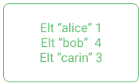
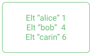
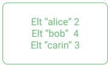

### Question 1

What notions are defined inside the smart contract ?

- [x] The type definition of the storage
- [ ] The balance of the contract
- [ ] The initial value of the storage
- [ ] The value of the entry point and its related parameters
- [x] The type definition of the entry point
- [ ] The size of the storage
- [x] The code of the smart contract
- [ ] The list of users allowed to call the smart contract

### Question 2

What is returned by the execution of a smart contract ?

- [ ] The current storage state when invoking the smart contract
- [x] The modified storage state after invoking the smart contract
- [ ] The entry point that has been called (and its related parameters)
- [x] The list of emitted operations produced by the execution of the smart contract
- [ ] The balance of the contract
- [ ] The size of the storage
- [ ] The code of the smart contract
- [ ] The list of users allowed to call the smart contract

### Question 3

Consider the following Michelson smart contract.

```js
parameter nat;
storage nat;
code { DUP; CAR; DIP { CDR }; ADD; NIL operation; PAIR }
```

What is the stack at the beginning of the execution (considering parameter value is 2 and storage value is 5) ?
 
Check the right answer.

- [ ] nat 2 , nat 5


- [ ] nat 5, nat 2


- [x] (PAIR (nat 2) (nat 5))


- [ ] (PAIR (nat 5) (nat 2))


### Question 4

Consider the following Michelson smart contract.

```js
parameter nat;
storage nat;
code { DUP; CAR; DIP { CDR }; ADD; NIL operation; PAIR }
```

Considering that the parameter value is 1 and that the storage value is 1.
What will be the output of the execution ? 

- [ ] 2
- [ ] [ PAIR (1 1) ]
- [ ] Pair (1 1)
- [x] Pair ([], 2)
- [ ] Pair (2, [])


### Question 5
Consider the following Michelson smart contract.

```js
parameter (or (pair %assign address nat) (nat %global)) ;
storage (pair (big_map %owners address nat) (nat %value)) ;
code { DUP ;
       CDR ;
       SWAP ;
       CAR ;
       IF_LEFT
            { SWAP ;
              DUP ;
              CDR ;
              DUG 2 ;
              CAR ;
              SWAP ;
              UNPAIR ;
              DIP { SOME };
              UPDATE ;
              PAIR ;
              NIL operation ;
              PAIR
            }
            { SWAP ; CAR ; PAIR ; NIL operation ; PAIR } }
```

What are the possible invocations of this smart contract ?

- [ ] `(Pair (Pair "tz1b7tUupMgCNw2cCLpKTkSD1NZzB5TkP2sv" 7) 23)`
- [ ] `Left 30`
- [ ] `Left "tz1b7tUupMgCNw2cCLpKTkSD1NZzB5TkP2sv" 7`
- [x] `Right 45`
- [ ] `Right Right 12`
- [ ] `Left Left "tz1b7tUupMgCNw2cCLpKTkSD1NZzB5TkP2sv"`
- [x] `Left (Pair "tz1b7tUupMgCNw2cCLpKTkSD1NZzB5TkP2sv" 7)` 
- [ ] `Left (Pair "tz1b7tUupMgCNw2cCLpKTkSD1NZzB5TkP2sv" (Pair 7 23))`
- [ ] `Right (Pair "tz1b7tUupMgCNw2cCLpKTkSD1NZzB5TkP2sv" 23)`
- [ ] `(Pair (Left "tz1b7tUupMgCNw2cCLpKTkSD1NZzB5TkP2sv") (Right 23))`
- [ ] `Left (Pair (Left "tz1b7tUupMgCNw2cCLpKTkSD1NZzB5TkP2sv") (Right 23))`


### Question 6
Consider the following Michelson smart contract storage.

```js
storage (pair (pair  (set %participants nat) (pair (nat %age) (string %name))) (pair (big_map %owners address nat) (nat %value)));
```

Notice that the storage is composed of nested pairs.
Let's consider that the storage is the top element of the stack.
Which instruction can be used to retrieve the `big_map` part of the storage ?

- [ ] CDR
- [ ] CAR
- [x] CDAR
- [ ] CADR
- [ ] CAAR
- [ ] CADAR
- [ ] CADDR


### Question 7

Consider the following smart contract that allows to increment or decrement an integer counter:

```js
parameter (or (int %increment) (int %decrement)) ;
storage int ;
code {
       DUP ;
       CDR ;
       SWAP ;
       CAR ;
       XXXXX 
              { SWAP ; SUB }
              { ADD } ;
       NIL operation ;
       PAIR }
```

The XXXXX instruction must be replaced by a conditional instruction. Which instruction should be used ?

- [ ] IF
- [ ] IF_SOME
- [ ] IF_NONE
- [ ] IF_CONS
- [ ] IFCMPEQ
- [ ] IF_LEFT
- [x] IF_RIGHT


### Question 8

The following contract is incomplete:

```js
parameter (or (pair %assign string nat) (string %remove)) ;
storage (big_map string nat) ;
code { DUP ;
       CDR ;
       SWAP ;
       CAR ;
       IF_LEFT
          { UNPAIR ; DIP { SOME } }
          { XXXXXXX };
       UPDATE ;
       NIL operation ;
       PAIR
     }
```

Notice that the storage is a _big\_map_ and that the parameter allows two possible invocations: "assign" and "remove".

The "assign" entry point takes two arguments ( a "key" as a _string_ and a "value" as a _nat_) set in a _pair_. The goal of the "assign" entry point is to modify the storage (the _big\_map_) by assigning the given "value" to the given "key". 

The "remove" entry point takes a single argument (a "key" as a _string_). The goal of the "remove" entry point is to modify the storage by removing the given "key" from the _big\_map_. 

Complete the missing "XXXXXXX" sequence of instructions according to the previously-mentioned statements.

- [ ] UNPAIR ; SOME
- [ ] UNPAIR ; NONE
- [ ] UNPAIR ; DIP { SOME null }
- [ ] UNPAIR ; DIP { NONE }
- [ ] SWAP ; DIP { SOME }
- [ ] PAIR ; DIP { SOME }
- [ ] DIP { NONE }
- [ ] DIP { NONE null }
- [x] DIP { NONE nat }
- [ ] DIP { NONE unit }
- [ ] DIP { SOME }
- [ ] DIP { SOME nat }
- [ ] DIP { SOME null }


### Question 9

Consider the following "QCM_9.tz" smart contract.

```js
parameter int ;
storage (pair (set int) bool) ;
code {
       DUP ; CDAR ; SWAP ; CAR ; DIP { DUP } ;
       MEM ;
       SWAP ;
       PAIR ;
       NIL operation ;
       PAIR }
```

We invoke this contract with the following command:

```js
tezos-client run script QCM_9.tz on storage 'Pair {1;2;3;4} True' and input '5'
```

Notice that this command defines the initial storage state as `Pair {1;2;3;4} True` and the parameter as `5`.

What is the resulting storage state ?

- [ ] Pair {1;2;3;4;5} True
- [ ] Pair {5;1;2;3;4} True
- [ ] Pair {1;2;3;4;5} False
- [ ] Pair {5;1;2;3;4} False
- [x] Pair {1;2;3;4} False
- [ ] Pair {1;2;3;4} True

### Question 10

Consider the following "QCM_10.tz" smart contract.

```js
parameter unit ;
storage (map string nat) ;
code {
       CDR ;
       MAP {  CDR ;
              DUP ;
              PUSH nat 2 ;
              SWAP ;
              EDIV ;
              IF_NONE
                     { FAIL }
                     { CDR ;
                       INT ;
                       IFEQ
                            {}
                            { PUSH nat 2; MUL}
                     }
           } ;
       NIL operation ;
       PAIR }
```

We invoke this contract with the following command:

```js
tezos-client run script QCM_10.tz on storage '{ Elt "alice" 1; Elt "bob" 2; Elt "carin" 3 }' and input 'Unit'
```

Notice that this command defines the initial storage state as `{ Elt "alice" 1; Elt "bob" 2; Elt "carin" 3 }` and the parameter as `Unit`.


What is the resulting storage state ?

- [ ] { Elt "alice" 1; Elt "bob" 2; Elt "carin" 3 }


- [ ] { Elt "alice" 1; Elt "bob" 4; Elt "carin" 3 }



- [ ] { Elt "alice" 1; Elt "bob" 4; Elt "carin" 6 }



- [ ] { Elt "alice" 1; Elt "bob" 2; Elt "carin" 6 }


- [ ] { Elt "alice" 2; Elt "bob" 2; Elt "carin" 3 }


- [ ] { Elt "alice" 2; Elt "bob" 4; Elt "carin" 3 }



- [x] { Elt "alice" 2; Elt "bob" 2; Elt "carin" 6 }


- [ ] { Elt "alice" 2; Elt "bob" 4; Elt "carin" 6 }


