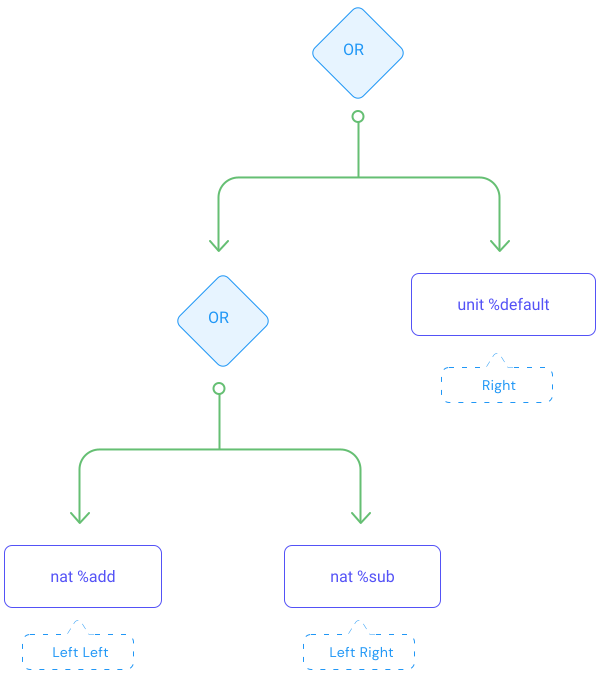

## Smart contract

Michelson is a domain-specific language and is designed for implementing smart contracts. Tezos smart contracts contain three main pieces of information:
- the **parameter** of the smart contract which describes the possible invocations of the smart contract (often called **entrypoints**)
- the type definition of the persistent data structure associated with the smart contract (referred to as **storage**)
- a sequence of instructions to be executed when invoking the smart contract (this is the **code** of the smart contract)

Basically, an empty smart contract defines those three pieces of information (parameter, storage, code) and looks like this:

```js
parameter unit;
storage unit;
code { CDR ;
       NIL operation ;
       PAIR };
```

These three instructions will be described later in the "invocation" sub-section of this chapter and in the "Instructions" section.

### Entry point

The **parameter** of the smart contract describes all possible invocations of the smart contract.
An entrypoint is a invocable function of the smart contract which takes arguments. These arguments are specific to the entrypoint.

Each entrypoint is composed of:
- the type definition of the expected argument of the entrypoint 
- the annotation (name) of the entrypoint.


The example below (Counter contract) shows a simple smart contract implementing a counter: 

```js
{ parameter (or (or (nat %add) (nat %sub)) (unit %default)) ;
  storage int ;
  code { AMOUNT ; PUSH mutez 0 ; ASSERT_CMPEQ ; UNPAIR ;
         IF_LEFT
           { IF_LEFT { ADD } { SWAP ; SUB } }
           { DROP ; DROP ; PUSH int 0 } ;
         NIL operation ; PAIR } }
```

Notice that in Counter contract the parameter describing possible invocations is defined as:

```js
(or (or (nat %add) (nat %sub)) (unit %default))
```

The three possible invocations (add, sub, and default) are specified in a single logical structure composed of logical _or_ operators. 
Since _or_ is a two-operand operator, we need a nested _or_ structure to represent 3 or more elements.


<small className="figure">FIGURE 1: Representation of the _or_ structure and how to specify the corresponding entry points (the identification of related entry points)</small>

We will delve into this more deeply in the code portion of the "union" section.

### Storage

The **storage** is a persistent memory space associated to the smart contract when deployed. The data structure of the storage is defined in the smart contract during the deployment phase.

Notice that in the Counter contract (above) the type definition describing the storage is:

```js
  storage int ;
```

### Code

The **code** of the smart contract is a sequence of Michelson instructions separated by semi-colons `;`.

We will delve into this more deeply in the code portion of the "instructions" section.

## Address and balance

In order to ba accessible to anyone on the Tezos network , a smart contract must be deployed. This deployment phase is called **origination**.

We will delve into this more deeply in the Tezos-basics chapter ("CLI and RPC" section).

Tezos smart contracts have built-in internal information available once the smart contract has been deployed:
- the **address** of the smart contract is a unique identifier  
- the **balance** represents the quantity of XTZ associated with a smart contract. The smallest divisible part is a mutez (1 tez = 1,000,000 mutez).


## Stack-based language

Generally a _stack_ data structure is a linear collection of elements where elements can be added or removed with `PUSH` and `POP` instructions. In the Michelson language, elements can be pushed to the top of the pile (with `PUSH`) or removed from the top of the pile (with `DROP`). This kind of stack is called LIFO (Last In First Out).


<small className="figure">FIGURE 2: Illustration of a stack</small>

The _Instructions_ section describes basic stack manipulations allowed by the Michelson language.

## Invocation and transaction return (list of operations, storage)

The **invocation** of a smart contract is an explicit call for executing the code of the smart contract. It requires a call parameter which is a tuple of two elements (`PAIR`) containing:
- a value of the entry point
- the value of the storage (current storage state)

The invocation of the smart contract is expected to produce a tuple of two elements (`PAIR`) containing:
- a list of operations (which are new transactions generated by this invocation).
- the new storage state.

This list of operations represents all impacts your contract will have on the rest of the Tezos blockchain.
The new storage state represents the impact your invocation will have on the contract storage.

The diagram below describes the execution of the "empty smart contract" (seen in the previous section). Although this contract does not modify anything, it still has to fulfill the mentioned expectations (input and output format). 


<small className="figure">FIGURE 3: Execution of `CDR ; NIL operation ; PAIR`</small>

Notice that this script performs no modifications. Storage is given as a parameter and returned.


Now, let's dive deep into the Michelson language.
