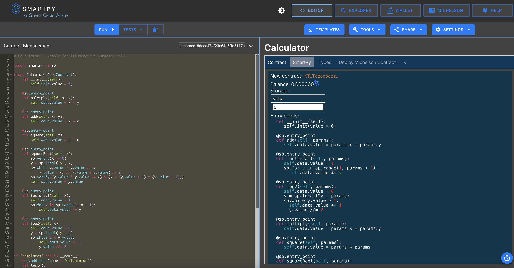
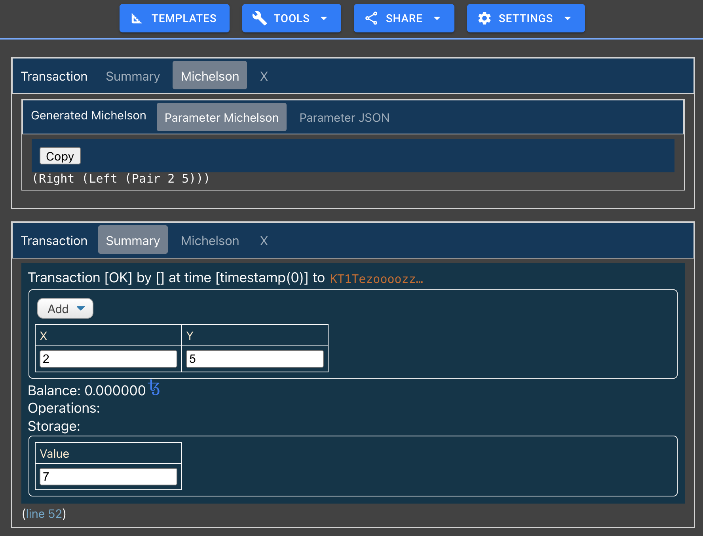
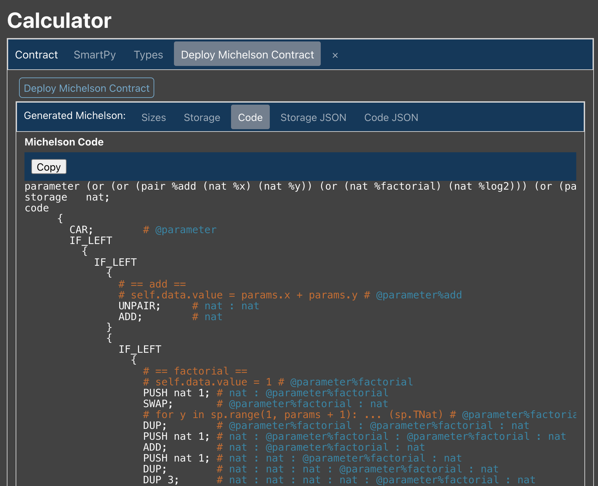

This chapter aims at preparing your working environment in order to be ready to code, 
test and compile your smart contracts.

## Write, test and compile from your IDE

### Prerequisite

- Python 3
- Text editor

### Creation of a virtual environment
A virtual environment is a self-contained python installation, separated from the global Python installation.
It contains its own modules. Hence, it is most useful when a specific module version is needed, without affecting the other modules.
Run this command to create a virtual environment:

```shell
python3 -m venv /path/to/env
```

### Activating the environment

```shell
source /path/to/env/bin/activate
```

### Installation of SmartPy library

```shell
(venv) pip install smartpy
```

Verification of the installation:

```shell
(venv) python -c "import smartpy"
```

If the command returns nothing then the installation is successful.

### Installation of the command line interface

```shell
sh <(curl -s https://smartpy.io/cli/install.sh)
```

#### Compiling SmartPy Contracts or Expressions

_SmartPy.sh compile_

```shell
~/smartpy-cli/SmartPy.sh compile <script.py> <output-directory>
```

This includes many outputs including:
- generated michelson code for contract and storage
- generated json code for contract and storage

#### Executing a SmartPy Script with its tests

_SmartPy.sh test_

```shell
~/smartpy-cli/SmartPy.sh test <script.py> <output-directory>
```

This includes many outputs: types, generated michelson code, pretty-printed scenario, etc.

## Online Editor

The SmartPy online editor isn’t just a simple text editor for smart contracts. 
It comes with a built-in simulation suite that provides powerful testing tools for developers.


<small className="figure">FIGURE 1: Smartpy.io Online Editor </small>

To familiarize yourself with SmartPy you can choose among the numerous existing examples 
of smart contracts, by going to the **Templates** tab.


<small className="figure">FIGURE 2: Smartpy.io Online Editor Templates </small>

On the left screen of the online Editor you can:
- Write your code on the left screen
- Run and test your code


<small className="figure">FIGURE 3: Smartpy.io Online Editor Code Area </small>

Once your run your code you can visualize the result on the right screen, which contains:
- Your python code
- Your generated michelson contract and storage code as well as the one in json format
- A summary of your test scenario and the generated michelson parameter code
- You can deploy your michelson contract


<small className="figure">FIGURE 4: Smartpy.io Online Editor Result Test Area </small>


<small className="figure">FIGURE 5: Smartpy.io Online Editor Result Michelson Contract Code </small>


## Reference

[1] https://smartpy.io/reference.html#_command_line_interface

[2] https://smartpy.io/ide
