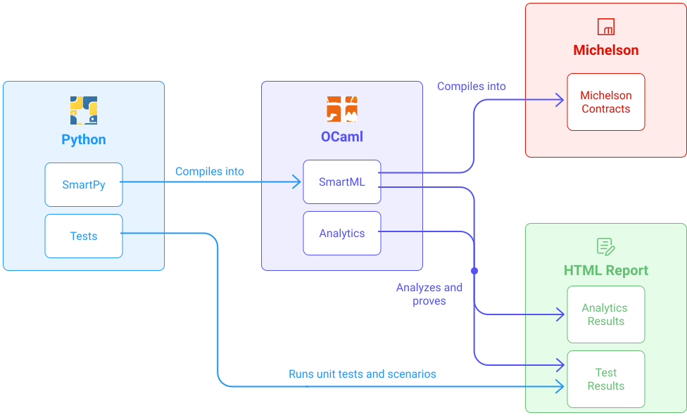

The goal of this module is to allow a developer to write smart contracts with _SmartPy_. In the form of a pedagogical course illustrated with an example of a smart contract, the developer will have acquired the essentials to write, test, and analyze his smart contract.

Tezos smart contracts are written in [Michelson](https://opentezos.com/michelson), which is a stack-based language. It is the lowest level of a Tezos smart contract: The Michelson code is what will be deployed on a Tezos network. However, if reading or writing Michelson code is still accessible for small smart contracts, it can become pretty tedious for more complex smart contracts:

- there are no variables nor functions
- no syntactic sugar //TODO: recap on definition, not everyone knows what syntactic sugar is
- the Michelson code cannot be broken down into several files
- stack-based languages are not commonly used when it comes to web development. 

**SmartPy solves these issues.**

It is a high-level smart contracts library and comes with related tools in the form of [SmartPy.io](https://smartpy.io/) to greatly ease the accessibility, understandability, and provability of smart contracts on Tezos. A few advantages are:

- It is based on a popular programming language: _Python_
- It has a set of high-level primitives, called _SmartML_, written in _OCaml_ for a new smart contracts virtual machine that can be compiled into Michelson. //TODO: Unclear, what is in ocaml? the smartpy primitives? So they are implemented in ocaml then michelson???
- It has a transpiler that translates _SmartML_ contracts into _Michelson_.
- It has analytics tools and a user interface on [SmartPy.io](https://smartpy.io) that provides some automated procedures to devploy, analyze and prove properties of smart contracts. //TODO: Unclear, is 'Analytics' a framework from Ocaml? 

<small className="figure">FIGURE 1: From SmartPy to Michelson, Tests, and Analytics </small>

Once built, SmartPy contracts become _SmartML_ contracts and are handled in an OCaml library called _SmartEngine_. It can then be compiled into a single Michelson code file.
This Michelson file is the smart contract that will be deployed on a Tezos network.

//TODO: Why is SmartPy translated into Ocaml then Michelson, and not directly in Michelson?

//TODO: Is it really 'compilation' or 'transpilation' intead ? Make sure to check the difference. I've replaced everything with "tranpiles' in the text and on the schmo, make sure this is correct please.

//TODO: Introduce the rest of the module, what are we going to do next?

## References

[1] https://tzstats.com/blog/next-gen-blockchain-indexing-for-tezos/https://smartpy.io/

[2] https://smartpy-io.medium.com/introducing-smartpy-and-smartpy-io-d4013bee7d4e
