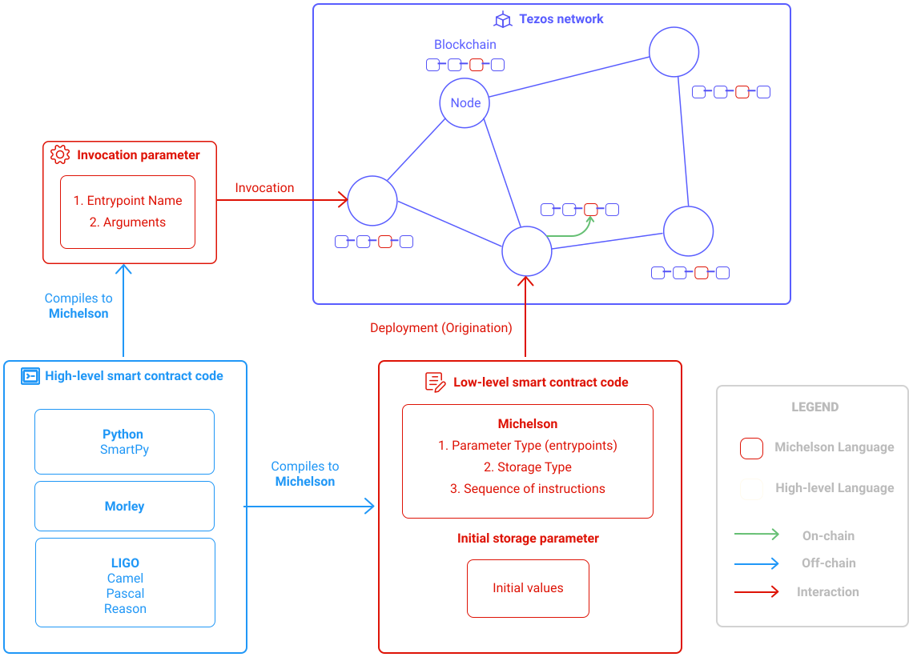

# Tezos basics Introduction to Smart contracts (WIP)

## General definition of a smart contract

//TODO
in this part, we will have speak about global smart contracts characteristics:
//TODO
- irrevocable computer programs
//TODO
- that execute a set of pre-defined instructions.
//TODO
- 'code is law' Lawrence Lessig
//TODO
- Secure an agreement between two or more parties thanks to the transparency and immutability of blockchains
//TODO
- Drastically reduce intermediate costs( vs the old world)
//TODO
- Danger of the security breach

## Lifecycle of a Tezos smart contract

A smart contract is deployed once and then can be invoked many times.

<small className="figure">FIGURE 1: Deploy and invoke smart contracts</small>

### Deployment of the smart contract

In Tezos blockchain which is a transactional system (called *UTXO*), a smart contract is born from a transaction which describes the smart contract behavior.

Transactions are broadcasted over the Tezos network and validated by bakers. Once validated transactions are executed and modifications are applied to the blockchain.

A transaction can contain transfer of a certain amount of XTZ to an account but can also can contain a set of pre-defined instructions (called **smart contract**) that will be stored in the blockchain. Once this transaction is executed, the smart contract is considered as deployed; an _address_ and a persistent memory space (called *storage*) are associated to this smart contract..

Once deployed the smart contract can be invoked by anyone via a transaction to the contract address (which will trigger the execution of the set of pre-defined instructions).

The CLI command `tezos-client originate` is provided for deploying a contract. It expects the 3 mentioned information as argument and returns the address associated with the newly deployed contract. 

See more detail in [CLI module]

A smart contract can communicate only within the Tezos network and thus can send transactions to other accounts or smart contracts.

These pre-defined instructions follow the Michelson language which is part of the protocol of the Tezos blockchain.

### Evolution of a deployed smart contract

Once deployed the code of smart contract is not meant to be modified, only the storage of the smart contract will be.

But we can forecast some possible evolutions of a smart contracts and thus implement in a way that some features can be upgraded.

- For data model extension one can use `map` data structures

- For changing business logic of a smart contract one can implement a "lambda" pattern (i.e. code the business logic of your smart contract in a lambda func inside the storage). So the business logic can be upgraded with a regular invocation of the smart contract (this invocation must specify the new business logic).

## Technical definition of a Tezos smart contract

The implementation of a smart contract must specify its:
- possibles invocations (called **entrypoints**)
- storage data structure definition 
- sequence of Michelson instructions

<small className="figure">FIGURE 2: Tezos smart contracts content</small>

### Code of the smart contrat

//TODO
Code is law.

The code of the smart contract is a sequence of Michelson instructions which is executed when the smart contract is invoked. 
This sequence of instructions is defined at deployment phase (called **origination**) and cannot be changed afterwards. 

The execution of this sequence of instructions results in a modification of the storage state. The sequence of instructions defines how the storage is modified.

The full description of the language Michelson is detailed in the Michelson module.

### The storage of the smart contract

During the origination (deployment phase), a persistent memory space (called **storage**) is allocated to the smart contract. The initial state of the storage must be specified during the origination of the smart contract.

The storage can be changed by invoking the smart contract which will apply its sequence of instructions.

//TODO (keep ?)
The storage can be seen as the result of all modifications (from the initial storage state to now). 

One can use the CLI provided by tezos to inspect the storage state of a smart contract. The only required parameter is the address of the smart contract.

The growth of the storage (i.e; memory allocation of extra space) is paid as fees when the smart contract is invoked.
For more details see section [Fees and Reward]

### Invocation of the smart contract

A smart contract can be invoked by a person (implicit account) whose address starts with "tz1 .." or by a smart contract (account) whose address starts with a "KT1....".

The invocation of a smart contract is a transaction sent to the address of a smart contract. This transaction specifies which entrypoint is called and its related arguments. 

The invocation of an entrypoint triggers the execution of the sequence of Michelson instructions which result in modifying the storage and potentially generating other transactions.

One can use the CLI provided by tezos to interact with a node. The client application `tezos-client` allows anyone to deploy and invoke smart contracts.
The list of all commands are available at the Tezos Gitlab official website.

The Remote Procedure Call (RPC) also provides a way to send a request via HTTP to a Teozs node. 
The list of all URIs are available at the Tezos Gitlab official website.
For more details see section [CLI and RPC]

## High-level languages for Tezos smart contract implementation

Because Michelson is a low-level stack-based language, adoption to common developer is not easy. To solve this difficulty many Michelson transpilers have been developed in several flavor :

- Python : SmartPy
- Camel : Ligo
- Pascal : Ligo
- Morley : Morley
...